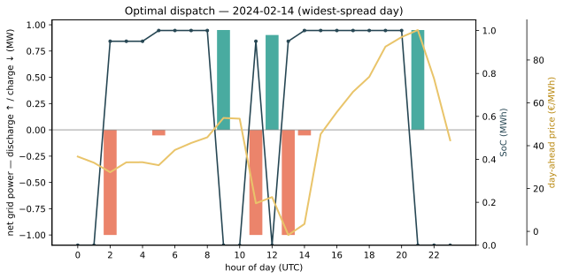
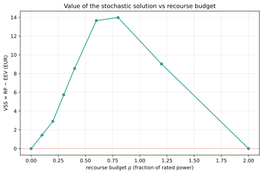
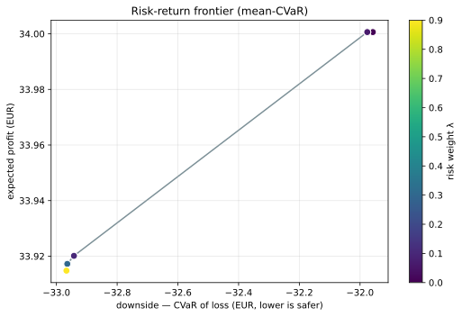
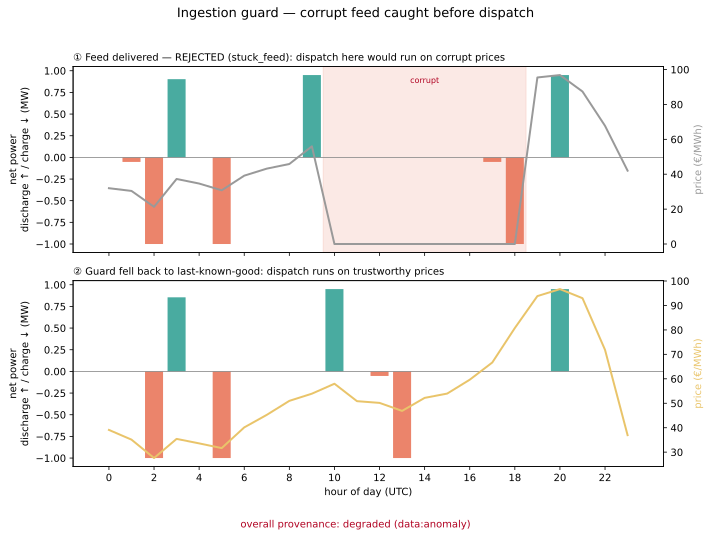

# bess-dispatch-optimizer

[](https://github.com/MoFirouzT/bess-dispatch-optimizer/actions/workflows/ci.yml)
[-brightgreen.svg)](tests/)
[](https://www.python.org/)
[](LICENSE)

Grid-scale batteries earn money by charging when power is cheap and discharging when it is dear, but every cycle ages the cell and volatile renewable-driven prices make the timing hard.
This project computes the revenue-maximizing charge/discharge schedule for that trade-off, for a grid-scale **battery energy storage system (BESS)** in the Belgian/Dutch day-ahead market.

It starts from a deterministic mixed-integer linear program (MILP) that maximizes arbitrage revenue net of cell degradation given a price curve and a battery's physical limits, then builds up to probabilistic price forecasting and a risk-aware stochastic dispatch layer for when prices are *not* known in advance.
Correctness is gated by golden oracles and Hypothesis property tests; the layered architecture, docs charter, and forecast calibration are all enforced in CI.

## What problem this solves

A battery earns money by **buying low and selling high**, but every cycle ages the cell, charging and discharging each lose energy (round-trip efficiency < 1), and the schedule must respect power, energy, and ramp limits.

There are really two problems here.
When the price curve is **known**, dispatch is a deterministic optimization: the project solves it to optimality and measures how much of that ceiling a realistic no-look-ahead policy captures (Release 1).
When prices are **uncertain**, the decision has to hedge across scenarios: the project forecasts prices as calibrated intervals and solves a two-stage risk-aware program whose value over a naive mean-forecast plan is measurable (Release 2).

## The model

The core is a MILP over $T$ dispatch periods that maximizes grid-side arbitrage revenue minus a degradation cost $D_t$:

$$\max \sum_{t} \Bigl[ \pi_t \Delta t (p^{dis}_t - p^{ch}_t) - D_t \Bigr]$$

subject to the state-of-charge balance, the one equation where round-trip efficiency enters:

$$e_t = e_{t-1} + \eta^{ch} p^{ch}_t \Delta t - \tfrac{p^{dis}_t}{\eta^{dis}} \Delta t$$

plus power, energy, and ramp limits, a binary that forbids simultaneous charge and discharge, and a terminal-SoC target. The degradation cost $D_t = c^{deg} \tau_t$ is linear in per-period storage-side throughput (the linear DoD-stress case of the Xu 2018 / Shi 2017 cycle-based model), so it stays native to the LP. Release 2 extends this into a two-stage stochastic program with a CVaR risk term and intraday recourse (§R2.3).

The one non-obvious design choice is that **all power is metered grid-side**, so degradation is a cost subtracted from cash rather than an efficiency factor, and never touches the SoC balance.
The complete model, every constraint, and the governing references are in [docs/formulation.md](docs/formulation.md) (start with its "Model at a glance" summary).

## Status

**Deterministic core and serving (Release 1), complete**, gated by golden + property tests:

- **R1.1**: deterministic MILP dispatch core
- **R1.2**: linear degradation cost on throughput
- **R1.3**: pre-flight feasibility checks
- **R1.4** (backtest, data, and data reliability):
  - **R1.4a**: walk-forward backtest with greedy / rolling / perfect-foresight baselines
  - **R1.4b**: live ENTSO-E day-ahead loader (BE/NL)
  - **R1.4c**: anomaly-aware ingestion guard, a *second* circuit breaker on the data feed, classifying each fetch outage / anomalous-but-present / healthy before it can reach the solver
- **R1.5**: FastAPI dispatch service with a graceful-degradation circuit breaker (greedy fallback on solver timeout), Dockerized

**Release 2 (forecasting → stochastic optimization), complete through R2.3**, gated by golden + property tests:

- **R2.1**: probabilistic price forecaster: LightGBM quantile models wrapped in conformal prediction (MAPIE) for calibrated day-ahead price *intervals*, gated by empirical coverage under walk-forward
- **R2.1b**: rolling drift monitor: separates a *regime shift* (market changed; a naive baseline degrades too) from *model staleness* (the model decayed relative to a seasonal-naive), so the flag is actionable
- **R2.2**: scenario generation and reduction: residual-path bootstrap into probability-weighted price paths, reduced ~300 → ~50 within a Kantorovich tolerance
- **R2.3**: risk-aware two-stage dispatch with intraday MPC recourse: a CVaR mean-risk MILP with a measured **value of the stochastic solution (VSS) > 0** out-of-sample, plus a risk/return frontier (see [Value under uncertainty](#value-under-uncertainty-release-2))

**Remaining (Release 2):** **R2.4** dual-based explainability. See [docs/architecture.md](docs/architecture.md).

## Example results

**On real Dutch day-ahead prices, a rolling, no-look-ahead policy captures 99.0% of the perfect-foresight revenue ceiling.**
Once the price curve is known, a myopic per-day policy is already near-optimal, so the deterministic problem is essentially solved. The value left on the table is not overnight foresight but *not knowing prices in advance*, which is what Release 2 addresses (and where a measured VSS shows up; see [Value under uncertainty](#value-under-uncertainty-release-2)).

The numbers below are from a worked example over a 91-day 2024-Q2 ENTSO-E NL day-ahead window (1 MWh / 1 MW asset, η = 0.95), **net of a priced linear degradation cost** (R1.2, €15/MWh of throughput). No price data is committed; set an ENTSO-E token and run [`examples/worked_example.py`](examples/worked_example.py) to reproduce (without a token it falls back to a synthetic series):

| Baseline | Net profit (91 days) | Share of ceiling |
| --- | --- | --- |
| Greedy floor (percentile rule) | €4,441 | 55% |
| Rolling deployable (per-day optimal) | €8,056 | **99.0%** |
| Perfect-foresight ceiling | €8,139 | 100% |

Rolling is each day's independent optimum (every day solved empty-to-empty with full knowledge of *that* day), so the whole €84 gap to the ceiling (1.0%) is pure cross-day carry: the overnight SoC a per-day agent cannot justify without tomorrow's prices, which is exactly what Release 2 targets. Wear is priced, not ignored: it removes nearly a third of gross ceiling revenue (€11,643 gross → €8,139 net) and cuts the naive greedy floor more, since greedy cycles without regard to degradation. Annualizing this volatile quarter (~9% negative-price hours) puts the net ceiling near €33k per MWh-installed per year; a calmer year sits lower. Because gate D derives its band from each window's own price spread, a volatile quarter legitimately lands high without tripping it.

These figures are for a **1-hour** asset (1 MWh / 1 MW). Storage duration (energy-to-power ratio) is a reported axis, not a fixed choice: both the capture ratio and the per-MWh value fall as duration grows, because a longer asset arbitrages a flatter slice of the daily spread and leaves more cross-day carry on the table. On the same real quarter, the annualized ceiling drops from ~€33k/MWh·yr at 1h to ~€24k at 4h. Run [`examples/duration_sweep.py`](examples/duration_sweep.py) for the {1h, 2h, 4h} sweep ([ADR-0022](docs/decisions/0022-storage-duration-reported-axis.md)).



### Value under uncertainty (Release 2)

The deterministic result above assumes the price curve is known. Release 2 drops that assumption: it forecasts prices as calibrated intervals (R2.1), samples them into scenarios (R2.2), and solves a two-stage risk-aware program that commits a day-ahead schedule now and re-dispatches intraday once prices realize (R2.3).

That machinery only earns its place if it beats simply optimizing against the mean forecast. It does: the **value of the stochastic solution (VSS) is positive**, measured out-of-sample on held-out real days, and it rises then falls with the intraday recourse budget ρ (zero recourse and unlimited recourse both collapse to the mean-value plan; the value lives in between). Trading expected profit for downside protection traces a mean-CVaR frontier.





Both figures are built from real NL day-ahead prices reshaped into daily scenarios; reproduce with `examples/stochastic_demo.py` (token, synthetic fallback otherwise).

Solve time scales benignly with horizon (one binary plus a few continuous variables per period); [`examples/benchmark_scaling.py`](examples/benchmark_scaling.py) reports it (numbers are from a local run, so treat them as relative):

| Horizon | Periods | Median solve |
| --- | --- | --- |
| 1 day | 24 | ~9 ms |
| 1 week | 168 | ~29 ms |
| 1 month | 720 | ~120 ms |

The plotting dependency is optional: `uv sync --group examples` installs it.

## Architecture

The `bess` package is split into layers with a strict downward-only import direction (`api` at the top, `assets` at the base), enforced in CI by import-linter. The headline invariant is `optimizer ⊥ api`: the deterministic core never depends on the serving layer, so it stays testable in isolation. The full layer map and dependency diagram are in [docs/architecture.md](docs/architecture.md).

## How to read the docs

Start with [docs/architecture.md](docs/architecture.md) for the map, then dive into the math.

| Doc | What it is |
| --- | --- |
| [docs/formulation.md](docs/formulation.md) | **The math**: single source of truth for every constraint and objective term |
| [docs/conventions.md](docs/conventions.md) | Locked conventions: units, sign/metering, time, naming |
| [docs/glossary.md](docs/glossary.md) | Domain + optimization terms, each with a common-error note |
| [docs/market_reference.md](docs/market_reference.md) | How the BE/NL day-ahead market actually works |
| [docs/references.md](docs/references.md) | Source references, for the phases that use one |
| [docs/specs/](docs/specs/) | Per-phase work orders |

Assumes some familiarity with linear/integer programming; battery and power-market terms are defined in the [glossary](docs/glossary.md).

## Development

```bash
uv sync                       # environment + dependencies
uv run pytest                 # tests (golden + property gates)
ruff check . && ruff format . # lint + format
uv run lint-imports           # layering contract
```

The probabilistic forecaster (R2.1) is an optional dependency group: `uv sync --group forecast`, then `uv run --group forecast pytest tests/unit/test_forecaster_model.py`. On macOS LightGBM needs the OpenMP runtime (`brew install libomp`); Linux CI links `libgomp`, so this is local operator setup only.

## Serving

```bash
uv run uvicorn bess.api.app:app          # POST /dispatch, GET /health
docker build -t bess-dispatch . && docker run -p 8000:8000 bess-dispatch
```

`POST /dispatch` takes a price curve, a step, and a battery spec, and returns the optimal schedule. If the solver misses the latency budget (`BESS_LATENCY_BUDGET_S`, default 2.0 s), the circuit breaker serves the greedy schedule instead (`mode: "fallback_greedy"`) rather than failing the request; invalid input returns a structured 422.

## Data

The tests and CI use **synthetic** price series only, no real or third-party market data is committed (the ENTSO-E terms grant no public-redistribution right). Real Belgian/Dutch day-ahead prices are fetched at runtime via `bess.data.entsoe.fetch_day_ahead`, which wraps the [ENTSO-E Transparency Platform](https://transparency.entsoe.eu/) and caches to `data/cache/` (gitignored).

To run the live loader (and its token-gated integration test, skipped without a token), copy `.env.example` to `.env` and set `ENTSOE_API_TOKEN`. On a network with a TLS-intercepting proxy, uv's bundled Python also needs the trust roots exported to a CA bundle (`REQUESTS_CA_BUNDLE` / `SSL_CERT_FILE`); the steps are in `.env.example`. This is operator setup, not code, and CI never touches the live API.

### Data reliability

A dispatch is only as trustworthy as the price it was computed from, so the data feed gets its own circuit breaker, distinct from the solver breaker above. `bess.data.ingestion_guard` classifies every fetch as **healthy**, **outage** (timeout / 5xx, i.e. no data), or **anomalous-but-present** (a frozen/stuck feed, a grid gap, a duplicate timestamp, or a value outside the EPEX SDAC clearing-price limits), and on either failure falls back to the last-known-good series rather than letting corrupt data reach the optimizer. A stale-but-present price is treated as *more* dangerous than an obvious outage because it fails silently, so a schedule solved on fallback data is reported as degraded, not healthy.

The checks key on feed *pathology*, not price *level*: zero and negative day-ahead prices are legitimate in BE/NL (high-renewable windows), so a real solar-glut day is never mistaken for corruption. The discriminator is the **value** a bit-identical run repeats, not the run's length. Excess supply collapses the clearing price onto the natural zero bid, so the market really does clear at exactly €0.00 for hours on end (NL and BE both did for 8 straight hours on 2024-03-24); it does not clear at an arbitrary cent repeatedly, and that is a frozen feed. Keying on the value rather than the length is what lets the guard both leave a genuine zero-price day alone and catch a freeze three times faster.



Reproduce with `uv run --group examples python examples/ingestion_guard_demo.py`.

## Known limitations and future work

The core is a deterministic, single-asset, day-ahead dispatch engine, and its scope boundaries are deliberate:

- **The deterministic core takes prices as known.** The core MILP solves against a given day-ahead curve. Price *uncertainty* is handled by the Release 2 stack layered on top (forecaster R2.1 → scenarios R2.2 → two-stage risk-aware dispatch with intraday recourse R2.3), whose value over a mean-forecast plan is the VSS reported above; the remaining Release 2 item is dual-based explainability (R2.4).
- **Day-ahead arbitrage only.** Intraday, imbalance, and ancillary-service markets (FCR / aFRR) are out of scope; the asset trades a single energy market.
- **No grid-connection / congestion constraint.** Dispatch is not capped at a connection-point limit. Adding a congestion or curtailment cap is the natural next physical constraint and is relevant to Dutch (TenneT) grid conditions.
- **Linear degradation only.** The degradation cost is linear in throughput (R1.2, the linear DoD-stress case); the nonlinear convex deep-cycle penalty, rainflow cycle-counting, and calendar aging are not modelled.
- **Single asset, single node.** No portfolio of assets and no network model.
