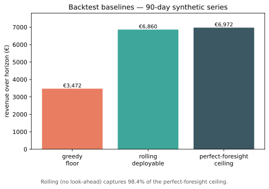

# bess-dispatch-optimizer

[](https://github.com/MoFirouzT/bess-dispatch-optimizer/actions/workflows/ci.yml)
[](https://www.python.org/)
[](LICENSE)

Grid-scale batteries earn money by charging when power is cheap and discharging when it is dear, but every cycle ages the cell and volatile renewable-driven prices make the timing hard. This project computes the revenue-maximizing schedule for that trade-off.

Optimal day-ahead dispatch for a grid-scale **battery energy storage system (BESS)** in the Belgian/Dutch power market. Given a day-ahead price curve and a battery's physical limits, it computes the charge/discharge schedule that maximizes arbitrage revenue net of cell degradation, formulated as a deterministic mixed-integer linear program (MILP). Correctness is gated by golden oracles and Hypothesis property tests; the layered architecture, docs charter, and forecast calibration are all enforced in CI.

## What problem this solves

A battery earns money by **buying low and selling high**: charge when day-ahead electricity is cheap, discharge when it is expensive. The catch is that every cycle ages the cell, charging and discharging each lose energy (round-trip efficiency < 1), and the schedule must respect power, energy, and ramp limits. This project formulates that trade-off precisely and solves it to optimality, then measures how much of the theoretical maximum a realistic, no-look-ahead policy actually captures.

## The model

The core is a MILP over $T$ dispatch periods. It maximizes grid-side arbitrage revenue minus a degradation cost $D_t$:

$$\max \sum_{t} \Bigl[\, \pi_t\, \Delta t \,(p^{dis}_t - p^{ch}_t) \;-\; D_t \,\Bigr]$$

subject to a state-of-charge balance in which round-trip efficiency lives (never in the objective), plus power, energy, and ramp limits and a binary that forbids simultaneous charge/discharge:

$$e_t = e_{t-1} + \eta^{ch} p^{ch}_t \Delta t - \tfrac{p^{dis}_t}{\eta^{dis}} \Delta t$$

The degradation cost is a **convex piecewise-linear** function of per-period throughput, encoded in **epigraph form**: one linear cut per segment $k$ bounds the auxiliary variable $D_t$ from below, and the objective presses it down onto the curve, so $D_t$ reconstructs the exact PWL cost with no special-ordered sets (HiGHS has none):

$$D_t \ge a_k\, \tau_t + b_k \qquad k = 1,\dots,K$$

The one non-obvious design choice: **all power variables are metered grid-side, so efficiency belongs only in the SoC balance, never in the revenue term.** Degradation is a cost subtracted from cash, not an efficiency factor, and it does not enter the balance. The full derivation, every constraint, and the governing references are in [docs/formulation.md](docs/formulation.md).

## Architecture at a glance

The `bess` package is split into layers with a strict downward-only import direction, enforced in CI by import-linter:

```
api → explain → stochastic → recourse → optimizer → validation → assets
                   ▲
    forecaster → scenarios ┘
```

The headline invariant is `optimizer ⊥ api`: the optimizer never depends on the serving layer. `data` (the ENTSO-E loader) and `backtest` (offline evaluation) sit deliberately outside this chain. See [docs/architecture.md](docs/architecture.md) for the full map.

## Status

**Deterministic core and serving (Release 1) — complete**, gated by golden + property tests:

- **R1.1** — deterministic MILP dispatch core
- **R1.2** — convex piecewise-linear degradation cost
- **R1.3** — pre-flight feasibility checks
- **R1.4** — walk-forward backtest with greedy / rolling / perfect-foresight baselines, plus a live ENTSO-E day-ahead loader (BE/NL)
- **R1.5** — FastAPI dispatch service with a graceful-degradation circuit breaker (greedy fallback on solver timeout), Dockerized
- **R1.5b** — anomaly-aware ingestion guard: a *second* circuit breaker on the data feed, classifying each fetch outage / anomalous-but-present / healthy before it can reach the solver

**Forecasting and drift monitoring (Release 2) — under way:**

- **R2.1** — probabilistic price forecaster: LightGBM quantile models wrapped in conformal prediction (MAPIE) for calibrated day-ahead price *intervals*, gated by empirical coverage under walk-forward
- **R2.1b** — rolling drift monitor: separates a *regime shift* (market changed; a naive baseline degrades too) from *model staleness* (the model decayed relative to a seasonal-naive), so the flag is actionable

**Stochastic optimization (Release 2) — planned:** scenario generation, stochastic optimization, recourse, and explainability. See [docs/architecture.md](docs/architecture.md).

## Example results

**A rolling, no-look-ahead policy captures 98.4% of the perfect-foresight revenue ceiling.** The residual gap is the cross-day (overnight) arbitrage a deterministic agent provably cannot reach, which is the opportunity Release 2 targets.

The numbers below come from a worked example on a **synthetic** 90-day Dutch-style day-ahead series (1 MWh / 1 MW asset, η = 0.95), reproducible with [`examples/worked_example.py`](examples/worked_example.py):

| Baseline | Revenue | Share of ceiling |
|---|---|---|
| Greedy floor (percentile rule) | €3,472 | 50% |
| Rolling deployable (per-day optimal) | €6,860 | **98.4%** |
| Perfect-foresight ceiling | €6,972 | 100% |

The annualized ceiling is ≈ €28k per MWh-installed per year, inside the structural sanity band (gate D).




Solve time scales benignly with horizon (one binary plus a few continuous variables per period); [`examples/benchmark_scaling.py`](examples/benchmark_scaling.py) reports it (numbers are from a local run, so treat them as relative):

| Horizon | Periods | Median solve |
|---|---|---|
| 1 day | 24 | ~9 ms |
| 1 week | 168 | ~29 ms |
| 1 month | 720 | ~120 ms |

The plotting dependency is optional: `uv sync --group examples` installs it.

## How to read the docs

Start with [docs/architecture.md](docs/architecture.md) for the map, then dive into the math.

| Doc | What it is |
|---|---|
| [docs/formulation.md](docs/formulation.md) | **The math** — single source of truth for every constraint and objective term |
| [docs/conventions.md](docs/conventions.md) | Locked conventions: units, sign/metering, time, naming |
| [docs/glossary.md](docs/glossary.md) | Domain + optimization terms, each with a common-error note |
| [docs/market_reference.md](docs/market_reference.md) | How the BE/NL day-ahead market actually works |
| [docs/references.md](docs/references.md) | The governing textbook reference for each phase |
| [docs/specs/](docs/specs/) | Per-phase work orders |

Assumes some familiarity with linear/integer programming; battery and power-market terms are defined in the [glossary](docs/glossary.md).

## Development

```bash
uv sync                       # environment + dependencies
uv run pytest                 # tests (golden + property gates)
ruff check . && ruff format . # lint + format
uv run lint-imports           # layering contract
```

The probabilistic forecaster (R2.1) is an optional dependency group: `uv sync --group forecast`, then `uv run --group forecast pytest tests/unit/test_forecaster_model.py`. On macOS LightGBM needs the OpenMP runtime (`brew install libomp`); Linux CI links `libgomp`, so this is local operator setup only.

## Serving

```bash
uv run uvicorn bess.api.app:app          # POST /dispatch, GET /health
docker build -t bess-dispatch . && docker run -p 8000:8000 bess-dispatch
```

`POST /dispatch` takes a price curve, a step, and a battery spec, and returns the optimal schedule. If the solver misses the latency budget (`BESS_LATENCY_BUDGET_S`, default 2.0 s), the circuit breaker serves the greedy schedule instead (`mode: "fallback_greedy"`) rather than failing the request; invalid input returns a structured 422.

## Data

The tests and CI use **synthetic** price series only — no real or third-party market data is committed (the ENTSO-E terms grant no public-redistribution right). Real Belgian/Dutch day-ahead prices are fetched at runtime via `bess.data.entsoe.fetch_day_ahead`, which wraps the [ENTSO-E Transparency Platform](https://transparency.entsoe.eu/) and caches to `data/cache/` (gitignored).

To run the live loader (and its token-gated integration test, skipped without a token), copy `.env.example` to `.env` and set `ENTSOE_API_TOKEN`. On a network with a TLS-intercepting proxy, uv's bundled Python also needs the trust roots exported to a CA bundle (`REQUESTS_CA_BUNDLE` / `SSL_CERT_FILE`); the steps are in `.env.example`. This is operator setup, not code, and CI never touches the live API.

### Data reliability

A dispatch is only as trustworthy as the price it was computed from, so the data feed gets its own circuit breaker, distinct from the solver breaker above. `bess.data.ingestion_guard` classifies every fetch as **healthy**, **outage** (timeout / 5xx, i.e. no data), or **anomalous-but-present** (a frozen/stuck feed, a grid gap, a duplicate timestamp, or a value outside the EPEX SDAC clearing-price limits), and on either failure falls back to the last-known-good series rather than letting corrupt data reach the optimizer. A stale-but-present price is treated as *more* dangerous than an obvious outage because it fails silently, so a schedule solved on fallback data is reported as degraded, not healthy.

The checks key on feed *pathology*, not price *level*: zero and negative day-ahead prices are legitimate in BE/NL (high-renewable windows), so a real solar-glut day is never mistaken for corruption. The anomaly signal is the *repetition* of a bit-identical value, not the value itself.


Reproduce with `uv run --group examples python examples/ingestion_guard_demo.py`.

## Known limitations and future work

Release 1 is a deterministic, single-asset, day-ahead dispatch engine. Its scope boundaries are deliberate:

- **Prices are taken as known.** The optimizer assumes the day-ahead curve is given; it does not forecast prices or model their uncertainty. Probabilistic forecasting and a two-stage stochastic / recourse layer are Release 2, which is where the cross-day arbitrage gap measured by the backtest (`V* − V_roll`) is meant to be captured.
- **Day-ahead arbitrage only.** Intraday, imbalance, and ancillary-service markets (FCR / aFRR) are out of scope; the asset trades a single energy market.
- **No grid-connection / congestion constraint.** Dispatch is not capped at a connection-point limit. Adding a congestion or curtailment cap is the natural next physical constraint and is relevant to Dutch (TenneT) grid conditions; it is named future work, not yet built.
- **Convex degradation only.** The degradation cost is a convex piecewise-linear curve (R1.2); rainflow cycle-counting and calendar aging are not modelled.
- **Single asset, single node.** No portfolio of assets and no network model.
