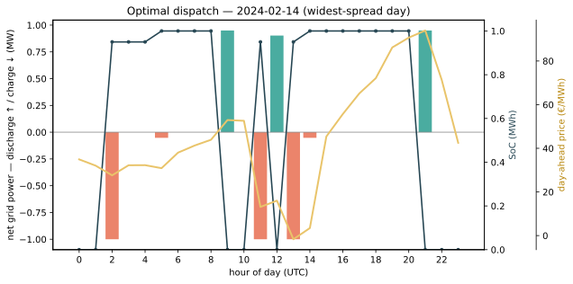
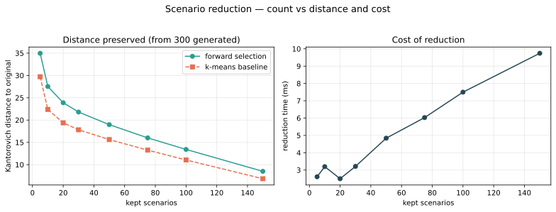
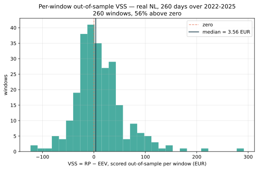
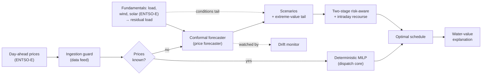
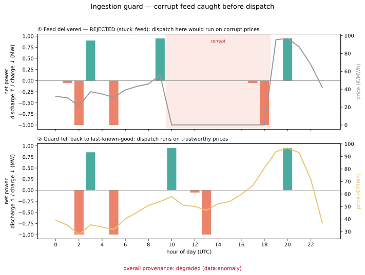

# bess-dispatch-optimizer

[](https://github.com/MoFirouzT/bess-dispatch-optimizer/actions/workflows/ci.yml)
[-brightgreen.svg)](tests/)
[](https://www.python.org/)
[](LICENSE)

Grid-scale batteries earn money by charging when power is cheap and discharging when it is dear, but every cycle ages the cell and volatile renewable-driven prices make the timing hard.
This project computes the revenue-maximizing charge/discharge schedule for that trade-off, for a grid-scale **battery energy storage system (BESS)** in the Belgian/Dutch day-ahead market.

It starts from a deterministic mixed-integer linear program (MILP) that maximizes arbitrage revenue net of cell degradation given a price curve and a battery's physical limits, then builds up to probabilistic price forecasting and a risk-aware stochastic dispatch layer for when prices are *not* known in advance.
Correctness is gated by golden oracles and Hypothesis property tests; the layered architecture, docs charter, and forecast calibration are all enforced in CI.

## What problem this solves

A battery earns money by **buying low and selling high**, but every cycle ages the cell, charging and discharging each lose energy (round-trip efficiency < 1), and the schedule must respect power, energy, and ramp limits.

There are really two problems here.
When the price curve is **known**, dispatch is a deterministic optimization: the project solves it to optimality and measures how much of that ceiling a realistic no-look-ahead policy captures (Release 1).
When prices are **uncertain**, the decision has to hedge across scenarios: the project forecasts prices as calibrated intervals and solves a two-stage risk-aware program whose value over a naive mean-forecast plan is measurable (Release 2).

## The model

The core is a MILP over $T$ dispatch periods that maximizes grid-side arbitrage revenue minus a degradation cost $D_t$:

$$\max \sum_{t} \Bigl[ \pi_t \Delta t (p^{dis}_t - p^{ch}_t) - D_t \Bigr]$$

subject to the state-of-charge balance, the one equation where round-trip efficiency enters:

$$e_t = e_{t-1} + \eta^{ch} p^{ch}_t \Delta t - \tfrac{p^{dis}_t}{\eta^{dis}} \Delta t$$

plus power, energy, and ramp limits, a binary that forbids simultaneous charge and discharge, and a terminal-SoC target. The degradation cost $D_t = c^{deg} \tau_t$ is linear in per-period storage-side throughput (the linear DoD-stress case of the Xu 2018 / Shi 2017 cycle-based model), so it stays native to the LP. Release 2 extends this into a two-stage stochastic program with a CVaR risk term and intraday recourse ([the uncertainty formulation](docs/formulation-uncertainty.md)).

The one non-obvious design choice is that **all power is metered grid-side**, so degradation is a cost subtracted from cash rather than an efficiency factor, and never touches the SoC balance.
The complete model, every constraint, and the governing references are in [docs/formulation.md](docs/formulation.md) (start with its "Model at a glance" summary); the uncertainty layer is in [docs/formulation-uncertainty.md](docs/formulation-uncertainty.md) and the measurement protocols in [docs/formulation-evaluation.md](docs/formulation-evaluation.md).

## Status

Both releases are complete and gated by golden + property tests. Eight capabilities:

| Capability | What it does |
| --- | --- |
| **Dispatch core** | The deterministic MILP: grid-side physics, a linear wear cost on throughput, and closed-form feasibility checks ahead of the solver |
| **Backtest** | Walk-forward evaluation against greedy, rolling, and perfect-foresight baselines, with a provable ordering between them |
| **Data feed** | Live ENTSO-E day-ahead loader (BE/NL) behind an anomaly-aware ingestion guard, a *second* circuit breaker that classifies every fetch before it can reach the solver |
| **Serving** | FastAPI dispatch service with a graceful-degradation breaker (greedy fallback on solver timeout), Dockerized |
| **Price forecaster** | LightGBM quantile models under conformal prediction for calibrated day-ahead price *intervals* (**~90% empirical coverage** on real NL), conditioned on **residual load** (**13.4%** lower pinball loss), watched by a drift monitor that attributes degradation to a regime shift, staleness, or miscalibration |
| **Scenario generation** | Residual-path bootstrap into probability-weighted price paths, reduced ~300 → ~50 within a Kantorovich tolerance, with an extreme-value tail that prices spikes beyond the historical maximum (realized prices above the generator's ceiling fall from **7.4% to 1.0%**) and concentrates them on tight-margin hours |
| **Stochastic dispatch** | A CVaR mean-risk two-stage MILP with intraday MPC recourse, whose **value over a mean-forecast plan is measured out of sample** |
| **Dispatch explainability** | The state-of-charge shadow price as a **water value**, with a no-trade band and per-trade breakeven that say *why* the battery holds rather than trades |

Alongside these, seven [studies](docs/studies/) measure what the stack is worth. Four came back null, and are reported as nulls.

The phase-by-phase build record, including what each phase concluded, is the [phase ledger](docs/specs/README.md).

## Example results

Two results anchor the project: the deterministic core is essentially tight, so the value that remains is in handling price *uncertainty*, and that value is measurable and positive.

**On real Dutch day-ahead prices, a rolling, no-look-ahead policy captures 99.0% of the perfect-foresight revenue ceiling.**
Once the price curve is known, a myopic per-day policy is already near-optimal, so the deterministic problem is essentially solved. That is the foundation, not the headline: the value left on the table is not overnight foresight but *not knowing prices in advance*, which is exactly what Release 2 targets. That is where the project's differentiated result lives, a **measured value of the stochastic solution (VSS) with a positive median across real out-of-sample days** (see [Value under uncertainty](#value-under-uncertainty-release-2)).

The numbers below are from a worked example over a 91-day 2024-Q2 ENTSO-E NL day-ahead window (1 MWh / 1 MW asset, η = 0.95), **net of a priced linear degradation cost** (€15/MWh of throughput). No price data is committed; set an ENTSO-E token and run [`examples/worked_example.py`](examples/worked_example.py) to reproduce (without a token it falls back to a synthetic series):

| Baseline | Net profit (91 days) | Share of ceiling |
| --- | --- | --- |
| Greedy floor (percentile rule) | €4,441 | 55% |
| Rolling deployable (per-day optimal) | €8,056 | **99.0%** |
| Perfect-foresight ceiling | €8,139 | 100% |

Rolling is each day's independent optimum (solved empty-to-empty with full knowledge of that day only), so the whole €84 gap to the ceiling (1.0%) is pure cross-day carry: overnight SoC a per-day agent cannot justify without tomorrow's prices. Wear is priced, not ignored: it removes nearly a third of gross ceiling revenue (€11,643 gross → €8,139 net) and cuts the degradation-blind greedy floor harder. Annualized, this volatile quarter puts the net ceiling near €33k per MWh-installed per year; a calmer year sits lower.

Storage duration (energy-to-power ratio) is a reported axis, not a fixed choice: a longer asset arbitrages a flatter slice of the daily spread, so on the same real quarter the annualized ceiling falls from ~€33k/MWh·yr at 1 h to ~€24k at 4 h ([the duration study](docs/studies/storage-duration.md); run [`examples/duration_sweep.py`](examples/duration_sweep.py) for the {1h, 2h, 4h} sweep).



### Value under uncertainty (Release 2)

The deterministic result above assumes the price curve is known. Release 2 drops that assumption: it forecasts prices as calibrated intervals, samples them into scenarios, and solves a two-stage risk-aware program that commits a day-ahead schedule now and re-dispatches intraday once prices realize.

The forecaster predicts each price as a *calibrated interval*, not a point: LightGBM quantile models wrapped in conformal prediction. "Calibrated" is the load-bearing word, and it is measured rather than assumed. On real NL prices, the nominal 90% interval covers the realized price **89.2% of the time** out-of-sample under a leakage-safe walk-forward, so the scenarios drawn from it inherit an honest spread instead of false confidence. Calibration alone is cheap (a wide interval covers everything), so accuracy is measured separately: at the interval edges the forecaster's pinball loss is **0.22x / 0.28x a seasonal-naive baseline's** under the same walk-forward (below 1 is skill).


Reproduce with `uv run --group forecast --group examples python examples/forecast_demo.py` (token, synthetic fallback otherwise).

That forecaster began as an autoregression: its features were the price's own recent past plus the calendar. But a day-ahead price is the clearing point of an auction, and where it lands on the supply stack is set by **residual load**, the demand left after must-run wind and solar. The forecaster adds that driver: ENTSO-E publishes day-ahead load and wind/solar forecasts before the auction closes, so conditioning on residual load is both leakage-safe (it is the published forecast for the target hour, never the realized value) and honest (it inherits the same forecast error a real desk sees). Feeding it cuts the forecaster's walk-forward pinball loss by **13.4%** on real NL while empirical coverage stays at the nominal 90%, so the scenarios drawn downstream start from a sharper, better-conditioned signal.

A forecaster deployed against a live market decays, so the drift monitor watches its trailing accuracy and attributes *why* it degraded: a **regime shift** (the market moved; even a naive baseline degrades, so wait), **staleness** (the model fell behind a seasonal-naive, so retrain), or **miscalibration** (the intervals stopped covering, so recalibrate): an actionable alarm rather than a bare "accuracy dropped."


Reproduce with `uv run --group examples python examples/drift_demo.py` (synthetic by design: it renders the classifier's decision regions, not a market result).

A residual-path bootstrap then generates a few hundred price paths, and forward-selection reduction keeps the ~50 that best preserve the distribution (measured by Kantorovich distance), so the stochastic program stays small without discarding the tails that risk-aware dispatch cares about.



For a battery the decision-relevant part of the price distribution is its **tail**: a scarcity spike is precisely the hour to have saved charge for. Two refinements make that tail faithful. The residual-path bootstrap can only replay forecast errors it has already seen, so the largest spike any scenario prices is capped at the historical maximum, and real markets spike past it. Scenario generation fits an **extreme-value tail**, a Generalized Pareto distribution over the residual exceedances above a high threshold, and splices it onto the bootstrap, so a scenario can price an unprecedented spike in a calibrated way rather than by an arbitrary multiplier. On real NL held-out days, the share of realized prices above the plain generator's support ceiling (the highest price it gives any probability at all) falls from **7.4% to 1.0%**: spikes the capped bootstrap ruled out are now represented.


A spike is a scarcity event, so it does not fall uniformly across the day: it concentrates on tight-margin hours, high load against low renewables. A second refinement ties the tail's scale to residual load, the same driver the forecaster conditions on, so spikes are heavier where they physically occur. The dependence is measured, not assumed: on real NL the fitted tail scale rises about **69%** from slack hours to tight hours, so the risk-aware program reserves stored energy for the hours that actually risk a spike.


Reproduce the two tail figures with `uv run --group examples python examples/spike_tail_demo.py` and `examples/conditional_tail_demo.py` (both synthetic by design: they demonstrate the tail mechanism, not a market result).

That machinery only earns its place if it beats simply optimizing against the mean forecast. Repeating the out-of-sample measurement over **260 real delivery days spread across 2022 to 2025** (commitments fit on the trailing 28 days, then scored, fixed, on that day's realized prices) gives a **median per-window VSS of +8.36 EUR on BE**, whose 95% window interval [+4.57, +13.27] sits above zero, and **+5.76 EUR on NL**, whose interval does not. For the 2 MWh / 1 MW study asset.

Each figure carries two independent widths, both measured: the window interval above, and the spread from the random scenario draw itself (4.85 EUR here, so the NL headline is a mean over ten seeds rather than one lucky run). Reseeding moves the magnitude and not the sign.

The honest reading is that the stochastic layer pays, that the effect is **regime-dependent** (the 2022 gas crisis pays several times what calm years do), and that on Dutch prices alone it is not separable from zero. An earlier version of this section claimed +12.90 EUR on one 2024 quarter; [re-measuring on a four-year span](docs/specs/study-windowing.md) is what moved it, and the studies pages record the decomposition.



Reproduce with `uv run --group examples python examples/vss_study.py --mode full` (token, synthetic fallback otherwise; drop the flag for a fast strided preview). The mechanism, the risk/return frontier, and the full per-window distribution are in [docs/studies/stochastic-value.md](docs/studies/stochastic-value.md).

### What was measured, and what came back null

The stochastic *structure* earns money. Three attempts to earn more by feeding it a better picture of tomorrow did not, and they are reported as nulls rather than quietly dropped:

| Question | Answer |
| --- | --- |
| Does a better price forecast earn more euros than a seasonal-naive one? | [**Null**](docs/studies/forecast-value.md) in both markets, despite clear statistical skill |
| Does pricing unprecedented spikes in the scenarios earn more? | [**Null**](docs/studies/tail-value.md) at every recourse budget and in every year |
| Does a price-contingent bid curve beat a single blind schedule? | [**Null**](docs/studies/bid-curves.md) on euros, but it surfaced an unpriced delivery gap of 4 to 8 MWh per day on a 2 MWh asset |

All three share one mechanism: **intraday recourse adjusts after the price is known**, so a sharper day-ahead picture has little left to buy. Each was separated from a broken comparison by a designed instance where the effect *is* detected, and each carries golden and property gates on its scoring arithmetic.

Re-measuring all four on the wider span cut the same way each time: **the three nulls hardened and the one positive result shrank.** The delivery gap was the only quantity the wider window strengthened, which is why imbalance settlement is the next thing worth building. The full set, including how the nulls were validated, is in **[docs/studies/](docs/studies/)**.

Solve time scales benignly on both axes ([details](docs/studies/solve-scaling.md)): the deterministic MILP grows with the horizon, from ~9 ms for a day to ~120 ms for a month, while the two-stage program grows with the scenario count, from ~0.5 s at 10 scenarios to ~2.0 s at 50. That second axis is exactly the cost the reduction step (~300 → ~50 paths) keeps bounded.

The plotting dependency is optional: `uv sync --group examples` installs it.

### Why it holds (Release 2)

A schedule says *what* the battery does; the dual of the state-of-charge balance says *why*. That shadow price is the **water value**: the marginal worth of a stored MWh, borrowed from hydro-reservoir scheduling. It is flat while the battery is neither full nor empty and steps at a SoC bound, and it defines a **no-trade band** on price: charge only below the band, discharge only above it, hold in between. The band's width comes from round-trip loss and wear, not from the price, so an idle hour at a high price is explained rather than asserted, and each executed trade reports its breakeven slippage. `POST /explain` returns the schedule and this explanation from a single solve; the details are in [formulation.md §R2.4](docs/formulation.md#r24-shadow-price-explainability-derived-no-optimizer-change) and [the MILP dual re-solve rule](docs/decisions/milp-dual-resolve-rule.md).


Reproduce with `uv run --group examples python examples/explain_demo.py` (synthetic by design: it demonstrates the dual mechanism, not a market result).

## Architecture

The data flows one way, from a raw price feed to a schedule and its explanation. Whether prices are known splits the pipeline into the deterministic core (Release 1) and the forecasting-plus-stochastic stack (Release 2):


```mermaid
flowchart LR
    P["Day-ahead prices<br/>(ENTSO-E)"] --> G["Ingestion guard<br/>(data feed)"]
    F["Fundamentals: load,<br/>wind, solar (ENTSO-E)<br/>→ residual load"] --> FC
    G --> D{"Prices<br/>known?"}
    D -->|yes| OPT["Deterministic MILP<br/>(dispatch core)"]
    D -->|no| FC["Conformal forecaster<br/>(price forecaster)"]
    FC -.watched by.-> DM["Drift monitor"]
    FC --> SC["Scenarios<br/>+ extreme-value tail"]
    F -.conditions tail.-> SC
    SC --> ST["Two-stage risk-aware<br/>+ intraday recourse"]
    OPT --> SCH["Optimal schedule"]
    ST --> SCH
    SCH --> EX["Water-value<br/>explanation"]
```

Under the hood the `bess` package is split into layers with a strict downward-only import direction (`api` at the top, `assets` at the base), enforced in CI by import-linter. The headline invariant is `optimizer ⊥ api`: the deterministic core never depends on the serving layer, so it stays testable in isolation. The full layer map and dependency diagram are in [docs/architecture.md](docs/architecture.md).

## How to read the docs

Start with [docs/architecture.md](docs/architecture.md) for the map, then dive into the math.

| Doc | What it is |
| --- | --- |
| [docs/formulation.md](docs/formulation.md) | **The math**: single source of truth for every constraint and objective term (Release 1; preamble, conventions, changelog) |
| [docs/formulation-uncertainty.md](docs/formulation-uncertainty.md) | Not knowing the price: forecast, scenarios, the two-stage program, bid curves |
| [docs/formulation-evaluation.md](docs/formulation-evaluation.md) | What a reported number means: backtest information set, revenue ordering, value protocols |
| [docs/conventions.md](docs/conventions.md) | Locked conventions: units, sign/metering, time, naming |
| [docs/glossary.md](docs/glossary.md) | Domain + optimization terms, each with a common-error note |
| [docs/market_reference.md](docs/market_reference.md) | How the BE/NL day-ahead market actually works |
| [docs/references.md](docs/references.md) | Source references, for the phases that use one |
| [docs/studies/](docs/studies/) | Measured questions about the stack, nulls included |
| [docs/specs/](docs/specs/) | Per-phase work orders |

Assumes some familiarity with linear/integer programming; battery and power-market terms are defined in the [glossary](docs/glossary.md).

## Development

```bash
uv sync                       # environment + dependencies
uv run pytest                 # tests (golden + property gates)
ruff check . && ruff format . # lint + format
uv run mypy src               # static types
uv run lint-imports           # layering contract
```

The probabilistic forecaster is an optional dependency group: `uv sync --group forecast`, then `uv run --group forecast pytest tests/unit/test_forecaster_model.py`. On macOS it needs the OpenMP runtime; `.env.example` has the one-line setup.

## Serving

```bash
uv run uvicorn bess.api.app:app          # POST /dispatch, GET /health
docker build -t bess-dispatch . && docker run -p 8000:8000 bess-dispatch
```

`POST /dispatch` takes a price curve, a step, and a battery spec, and returns the optimal schedule. If the solver misses the latency budget (`BESS_LATENCY_BUDGET_S`, default 2.0 s), the circuit breaker serves the greedy schedule instead (`mode: "fallback_greedy"`) rather than failing the request; invalid input returns a structured 422.

## Data

The tests and CI use **synthetic** price series only, no real or third-party market data is committed (the ENTSO-E terms grant no public-redistribution right). Real Belgian/Dutch day-ahead prices are fetched at runtime via `bess.data.entsoe.fetch_day_ahead`, which wraps the [ENTSO-E Transparency Platform](https://transparency.entsoe.eu/). The same module fetches the fundamentals (`fetch_load_forecast`, `fetch_renewable_forecast`), the day-ahead load and wind/solar forecasts the forecaster conditions on.

To run the live loader (and its token-gated integration test, skipped without a token), copy `.env.example` to `.env` and set `ENTSOE_API_TOKEN`. Any extra local setup (a CA bundle behind a TLS-intercepting proxy, the forecaster's OpenMP runtime) is documented in `.env.example`; it is operator setup, not code, and CI never touches the live API.

Fetches are cached to parquet when `BESS_CACHE_DIR` points somewhere to write, which saves re-pulling the same history across runs; the live tests default it to the gitignored `data/cache/`. There is no expiry, because a published day-ahead price is a settled auction result that is never revised and each file is keyed on its exact window. The cache is derived data and safe to delete. Unset, nothing is cached and every fetch hits the API, which is what CI does.

### Data reliability

A dispatch is only as trustworthy as the price it was computed from, so the data feed gets its own circuit breaker, distinct from the solver breaker above. `bess.data.ingestion_guard` classifies every fetch as **healthy**, **outage** (no data), or **anomalous-but-present** (a frozen feed, a grid gap, a duplicate timestamp, an out-of-band value), and on either failure falls back to the last-known-good series, reporting the schedule as degraded rather than silently optimal; a stale-but-present price is treated as *more* dangerous than an obvious outage because it fails silently.

The checks key on feed *pathology*, never price *level*: zero and negative prices are legitimate in BE/NL, and the market really does clear at exactly €0.00 for hours on end (8 straight hours on 2024-03-24), so the stuck-feed check fires on a repeated *arbitrary* value, not a repeated focal one. The full classification rules are in [the ingestion-guard spec](docs/specs/data-feed.md).



Reproduce with `uv run --group examples python examples/ingestion_guard_demo.py`.

## Known limitations and future work

The core is a deterministic, single-asset, day-ahead dispatch engine, and its scope boundaries are deliberate:

- **The deterministic core takes prices as known.** The core MILP solves against a given day-ahead curve. Price *uncertainty* is handled by the uncertainty stack layered on top (forecaster → scenarios → two-stage risk-aware dispatch with intraday recourse), whose value over a mean-forecast plan is the VSS reported above, and whose dispatch decisions are explained by the shadow-price layer.
- **Day-ahead arbitrage only.** Intraday, imbalance, and ancillary-service markets (FCR / aFRR) are out of scope; the asset trades a single energy market.
- **No grid-connection / congestion constraint.** Dispatch is not capped at a connection-point limit. Adding a congestion or curtailment cap is the natural next physical constraint and is relevant to Dutch (TenneT) grid conditions.
- **Linear degradation only.** The degradation cost is linear in throughput (the linear DoD-stress case); the nonlinear convex deep-cycle penalty, rainflow cycle-counting, and calendar aging are not modelled.
- **The asset is a price taker, and that is asserted rather than measured.** Dispatch optimizes against the price and never feeds back into it. The assumption is sound for the 2 MWh / 1 MW study asset, which cannot move a bidding zone that trades in gigawatts, but it is the one load-bearing claim here that carries no measurement. Modelling the feedback needs an endogenous price (a residual supply curve); a cheaper first step is to re-score an existing schedule under an impact model and see where the price-taking optimum starts over-concentrating.
- **Committed volume can exceed what the battery delivers, and the gap is unpriced.** The [bid-curve study](docs/studies/bid-curves.md) measures it (median 4 to 8 MWh per day on a 2 MWh asset, depending on the recourse budget) but does not charge for it: imbalance settlement is what would, and it is not modelled.
- **Single asset, single node.** No portfolio of assets and no network model.
