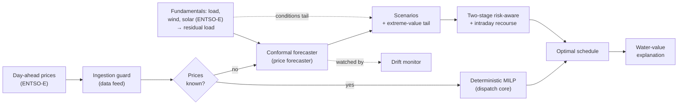

# bess-dispatch-optimizer

[](https://github.com/MoFirouzT/bess-dispatch-optimizer/actions/workflows/ci.yml)
[](https://www.python.org/)
[](LICENSE)
[](https://mofirouzt.github.io/bess-dispatch-optimizer/)

Revenue-maximizing charge/discharge schedules for a grid-scale **battery energy storage system (BESS)** in the Belgian/Dutch day-ahead market, from a deterministic mixed-integer linear program through to a risk-aware stochastic program for when tomorrow's prices are not known.

**On real Dutch day-ahead prices a rolling, no-look-ahead policy captures 99.0% of the perfect-foresight revenue ceiling**, so the deterministic problem is close to solved and the value that remains is in price uncertainty.
That value is measured, not asserted: a **median out-of-sample value of the stochastic solution of +8.36 EUR per window on BE** over 260 delivery days spanning 2022 to 2025, with a window interval above zero.
Nine [studies](docs/studies/) measure what the stack is worth; **three came back null and are published as nulls.**

*Assumes:* some familiarity with linear and integer programming. Battery and power-market terms are defined in the [glossary](docs/glossary.md).

## Try it

```bash
uv sync && uv run python examples/quickstart.py
```

Runs in about two seconds on the base install: no API token, no optional dependencies, no plotting.
It solves one day, bounds that schedule between a greedy floor and the perfect-foresight ceiling over a month, prints the shadow price that explains why the battery holds through a high price, and catches a corrupted price feed before it reaches the solver.
Prices are synthetic, so the numbers are illustrative; the real-data results are below.

## The model

A MILP over $T$ dispatch periods maximizing grid-side arbitrage revenue minus a degradation cost $D_t$:

$$\max \sum_{t} \Bigl[ \pi_t \Delta t (p^{dis}_t - p^{ch}_t) - D_t \Bigr]$$

subject to the state-of-charge balance, the one equation where round-trip efficiency enters:

$$e_t = e_{t-1} + \eta^{ch} p^{ch}_t \Delta t - \tfrac{p^{dis}_t}{\eta^{dis}} \Delta t$$

plus power, energy, and ramp limits, a binary forbidding simultaneous charge and discharge, and a terminal-SoC target.
The degradation cost $D_t = c^{deg} \tau_t$ is linear in per-period storage-side throughput (the linear depth-of-discharge stress case of the Xu 2018 / Shi 2017 cycle-based model), so it stays native to the LP.

**All power is metered grid-side**, which is why degradation is a cost subtracted from cash rather than an efficiency factor, and why it never touches the SoC balance.
Every constraint and its governing reference is in [docs/formulation.md](docs/formulation.md); the uncertainty layer is in [formulation-uncertainty.md](docs/formulation-uncertainty.md) and the measurement protocols in [formulation-evaluation.md](docs/formulation-evaluation.md).

## Status

Both releases are complete and gated by golden + property tests. Eight capabilities:

| Capability | What it does |
| --- | --- |
| **Dispatch core** | The deterministic MILP: grid-side physics, a linear wear cost on throughput, and closed-form feasibility checks ahead of the solver |
| **Backtest** | Walk-forward evaluation against greedy, rolling, and perfect-foresight baselines, with a provable ordering between them |
| **Data feed** | Live ENTSO-E day-ahead loader (BE/NL) behind an anomaly-aware ingestion guard, a *second* circuit breaker that classifies every fetch before it can reach the solver |
| **Serving** | FastAPI dispatch service with a graceful-degradation breaker (greedy fallback on solver timeout), Dockerized |
| **Price forecaster** | LightGBM quantile models under conformal prediction for calibrated day-ahead price *intervals*, conditioned on residual load, watched by a drift monitor that attributes degradation to a regime shift, staleness, or miscalibration |
| **Scenario generation** | Residual-path bootstrap into probability-weighted price paths, reduced ~300 → ~50 by forward selection on Kantorovich distance, with an extreme-value tail that prices spikes beyond the historical maximum and concentrates them on tight-margin hours |
| **Stochastic dispatch** | A CVaR mean-risk two-stage MILP with intraday MPC recourse |
| **Dispatch explainability** | The state-of-charge shadow price as a **water value**, with a no-trade band and per-trade breakeven that say *why* the battery holds rather than trades |

A ninth, **dispatch narration**, is built and gated but **not adopted**: its live acceptance run rejected 22% of narrations against the 5% bar its [spec](docs/specs/dual-narration.md) fixed beforehand, so the endpoint does not ship and the rate is the finding.
The phase-by-phase build record is the [phase ledger](docs/specs/README.md).

## Results

A worked example over a 91-day 2024-Q2 ENTSO-E NL window (1 MWh / 1 MW asset, η = 0.95), net of a priced linear degradation cost of €15/MWh of throughput:

| Baseline | Net profit (91 days) | Share of ceiling |
| --- | --- | --- |
| Greedy floor (percentile rule) | €4,441 | 55% |
| Rolling deployable (per-day optimal) | €8,056 | **99.0%** |
| Perfect-foresight ceiling | €8,139 | 100% |

Rolling is each day's independent optimum, so the whole €84 gap to the ceiling is cross-day carry: overnight SoC a per-day agent cannot justify without tomorrow's prices.
Wear is priced rather than ignored, and it removes nearly a third of gross ceiling revenue (€11,643 gross to €8,139 net).


Release 2 drops the assumption that the price curve is known: the forecaster's nominal 90% interval covers the realized price 89.2% of the time out-of-sample under a leakage-safe walk-forward, and its pinball loss at the interval edges is 0.22x / 0.28x a seasonal-naive baseline's.
Scenarios drawn from it carry an extreme-value tail tied to residual load, and the two-stage program commits a schedule now and re-dispatches once prices realize.

The stochastic *structure* earns money. Three attempts to earn more by feeding it a better picture of tomorrow did not:

| Question | Answer |
| --- | --- |
| Does a better price forecast earn more euros than a seasonal-naive one? | [**Null**](docs/studies/forecast-value.md) in both markets, despite clear statistical skill |
| Does pricing unprecedented spikes in the scenarios earn more? | [**Null**](docs/studies/tail-value.md) at every recourse budget and in every year |
| Does a price-contingent bid curve beat a single blind schedule? | [**Null**](docs/studies/bid-curves.md) on euros, but it surfaced an unpriced delivery gap of 4 to 8 MWh per day on a 2 MWh asset |

All three share one mechanism: intraday recourse adjusts after the price is known, so a sharper day-ahead forecast has little left to improve.
Each was separated from a broken comparison by a designed instance where the effect *is* detected, and each carries golden and property gates on its scoring arithmetic.

**The full results, every figure, and the scope limits are in [docs/results.md](docs/results.md);** the per-question write-ups, nulls included, are in [docs/studies/](docs/studies/).

## Architecture

The data flows one way, from a raw price feed to a schedule and its explanation. Whether prices are known splits the pipeline into the deterministic core (Release 1) and the forecasting-plus-stochastic stack (Release 2):


```mermaid
flowchart LR
    P["Day-ahead prices<br/>(ENTSO-E)"] --> G["Ingestion guard<br/>(data feed)"]
    F["Fundamentals: load,<br/>wind, solar (ENTSO-E)<br/>→ residual load"] --> FC
    G --> D{"Prices<br/>known?"}
    D -->|yes| OPT["Deterministic MILP<br/>(dispatch core)"]
    D -->|no| FC["Conformal forecaster<br/>(price forecaster)"]
    FC -.watched by.-> DM["Drift monitor"]
    FC --> SC["Scenarios<br/>+ extreme-value tail"]
    F -.conditions tail.-> SC
    SC --> ST["Two-stage risk-aware<br/>+ intraday recourse"]
    OPT --> SCH["Optimal schedule"]
    ST --> SCH
    SCH --> EX["Water-value<br/>explanation"]
```

The `bess` package is split into layers with a strict downward-only import direction (`api` at the top, `assets` at the base), enforced in CI by import-linter.
The headline invariant is `optimizer ⊥ api`: the deterministic core never depends on the serving layer, so it stays testable in isolation.
[docs/architecture.md](docs/architecture.md) has the layer map and the order to read the rest of the docs in.
The same docs are browsable with a search box at [mofirouzt.github.io/bess-dispatch-optimizer](https://mofirouzt.github.io/bess-dispatch-optimizer/).

## Development

Python, with [Pyomo](https://pyomo.org) over [HiGHS](https://highs.dev) for the MILP,
LightGBM under conformal prediction for the forecaster, FastAPI and Docker for serving,
and pandas throughout. Correctness rests on golden oracles and
[Hypothesis](https://hypothesis.readthedocs.io) property tests; CI additionally checks
static types, the layering contract, and the docs' own writing rules.

```bash
uv sync                       # environment + dependencies
uv run pytest                 # tests (golden + property gates)
uv run pytest --cov=bess      # coverage (CI gates this at 85%)
ruff check . && ruff format . # lint + format
uv run mypy src               # static types
uv run lint-imports           # layering contract
uv run python scripts/lint_docs.py  # the writing charter
```

The probabilistic forecaster is an optional dependency group: `uv sync --group forecast`. On macOS it needs the OpenMP runtime; `.env.example` has the one-line setup. Plotting for the figure scripts is another: `uv sync --group examples`.

## Serving

```bash
uv run uvicorn bess.api.app:app          # POST /dispatch, GET /health
docker build -t bess-dispatch . && docker run -p 8000:8000 bess-dispatch
```

`POST /dispatch` takes a price curve, a step, and a battery spec, and returns the optimal schedule.
If the solver misses the latency budget (`BESS_LATENCY_BUDGET_S`, default 2.0 s) the circuit breaker serves the greedy schedule instead (`mode: "fallback_greedy"`) rather than failing the request; invalid input returns a structured 422.
`POST /explain` adds the shadow-price explanation and is deliberately *not* behind the breaker: the greedy fallback has no duals, so a non-optimal solve returns 503 rather than an explanation of something else.
There is no third endpoint: dispatch narration was built, gated, and [not adopted](docs/specs/dual-narration.md), so nothing serves it.

## Data

Tests and CI use **synthetic** price series only; no real or third-party market data is committed, because the ENTSO-E terms grant no public-redistribution right.
Real Belgian/Dutch day-ahead prices and the load and wind/solar forecasts the forecaster conditions on are fetched at runtime through `bess.data.entsoe`.
To run the live loader and its token-gated integration tests, copy `.env.example` to `.env` and set `ENTSOE_API_TOKEN`; CI never touches the live API.
Fetches are cached to parquet when `BESS_CACHE_DIR` is set, with no expiry, because a published day-ahead price is a settled auction result that is never revised.

Every fetch is classified **healthy**, **outage**, or **anomalous-but-present** by `bess.data.ingestion_guard` before it can reach the solver, and either failure falls back to the last-known-good series and reports the schedule as degraded rather than silently optimal.
A stale-but-present price is treated as more dangerous than an obvious outage, because it fails silently.

## Scope

Single asset, single node, day-ahead energy only: no intraday or ancillary markets, no grid-connection cap, linear degradation only, and the asset is a price taker.
The full list, including what each omission would take to close and which of them the measurements argue for next, is at the end of [docs/results.md](docs/results.md).
