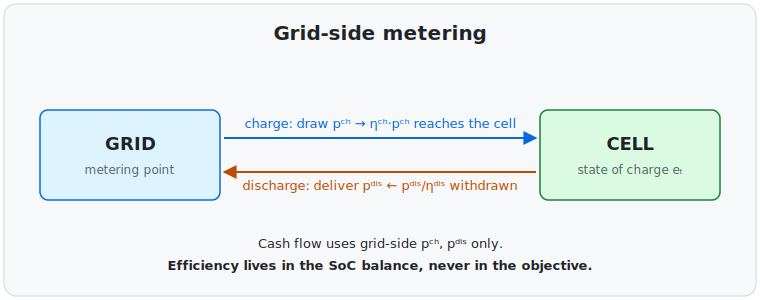
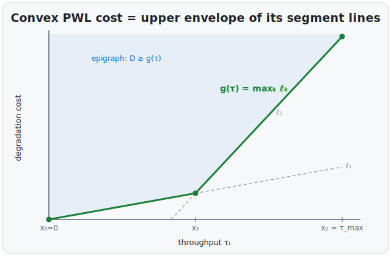

# BESS Dispatch Formulation

*The single source of truth for the optimization math.*

This file holds the canonical mathematics of the optimizer.
Specs, the README, and ADRs **point here**; they never restate equations.
Each phase appends a section; nothing is duplicated elsewhere.
Each section names its **governing reference** (see [references.md](references.md)) and summarizes only the theory the project implements; **house notation here and in [conventions.md](conventions.md) takes precedence** for shared quantities.

*Assumes: the house notation in [Conventions](conventions.md) (grid-side power, per-unit SoC, `π / e / η / Δt`).
Battery and power-market terms are defined in the [glossary](glossary.md); each section is self-contained, so read Conventions first.*

GitHub renders the `$$…$$` LaTeX below.

---

## Conventions

**Metering convention, the correctness trap:**
All power variables are measured at the **grid / AC terminal** (the metering point).
Efficiency therefore appears in the state-of-charge balance, and **never in the objective**:

- charging draws $p^{ch}_t$ from the grid, but only $\eta^{ch} p^{ch}_t$ reaches storage (charge losses);
- delivering $p^{dis}_t$ to the grid requires withdrawing $p^{dis}_t / \eta^{dis}$ from storage (discharge losses).

This is exactly the property-test invariant:

$$e_t = e_{t-1} + \eta^{ch}\, p^{ch}_t\, \Delta t \;-\; \frac{p^{dis}_t}{\eta^{dis}}\, \Delta t$$

The round-trip efficiency $\eta^{rt}=\eta^{ch}\eta^{dis}$ is **emergent**, not a separate term:
delivering 1 MWh to the grid ultimately costs $1/\eta^{rt}$ MWh drawn from the grid, enforced entirely by the balance above.

---

## R1.1. Deterministic core

*Governing reference: Williams, *Model Building in Mathematical Programming*.
See [references.md § R1.1](references.md#r11--deterministic-milp-dispatch) for secondary sources and notation mapping.*

### Sets

- $t \in \mathcal{T} = \{1,\dots,T\}$: dispatch periods. $\Delta t$ = period length in hours (1.0 hourly, 0.25 quarter-hourly).

### Parameters

| Symbol | Meaning | Unit |
| --- | --- | --- |
| $\pi_t$ | day-ahead price in period $t$ (known) | €/MWh |
| $\Delta t$ | period length | h |
| $\eta^{ch}, \eta^{dis}$ | charge / discharge efficiency, $\in(0,1]$ | – |
| $\bar P^{ch}, \bar P^{dis}$ | max charge / discharge power | MW |
| $e_{\min}, e_{\max}$ | usable SoC bounds | MWh |
| $R$ | ramp limit on net power | MW per period |
| $e_0$ | initial SoC, $\in[e_{\min}, e_{\max}]$ | MWh |
| $e^{\mathrm{tgt}}$ | terminal SoC target, $\in[e_{\min}, e_{\max}]$ | MWh |

Both endpoint parameters must lie inside the SoC bounds (config validation enforces this); the R1.3 reachability proof relies on it.

### Decision variables

| Symbol | Meaning | Domain |
| --- | --- | --- |
| $p^{ch}_t$ | grid-side charging power | $\ge 0$ |
| $p^{dis}_t$ | grid-side discharging power | $\ge 0$ |
| $e_t$ | state of charge at end of $t$ | $[e_{\min}, e_{\max}]$ |
| $u_t$ | charge indicator (1 = charging) | $\{0,1\}$ |

### Objective

Maximize day-ahead arbitrage revenue (grid-side cash flow, no efficiency term):

$$\max \;\; \sum_{t \in \mathcal{T}} \pi_t\, \Delta t \,\bigl(p^{dis}_t - p^{ch}_t\bigr)$$

### Constraints

**(1) State-of-charge balance** (with $e_0$ given as initial condition):

$$e_t = e_{t-1} + \eta^{ch} p^{ch}_t \Delta t - \frac{p^{dis}_t}{\eta^{dis}} \Delta t \qquad \forall t \in \mathcal{T}$$

**(2) SoC bounds:**

$$e_{\min} \le e_t \le e_{\max} \qquad \forall t \in \mathcal{T}$$

**(3) Power limits with mutual exclusion** (no simultaneous charge and discharge):

$$0 \le p^{ch}_t \le \bar P^{ch} u_t, \qquad 0 \le p^{dis}_t \le \bar P^{dis} (1 - u_t) \qquad \forall t \in \mathcal{T}$$

**(4) Ramp on net power** (for $t \ge 2$; $p^{net}_t \equiv p^{dis}_t - p^{ch}_t$):

$$-R \le p^{net}_t - p^{net}_{t-1} \le R \qquad \forall t \in \mathcal{T},\, t \ge 2$$

**(5) Terminal SoC:**

$$e_{T} = e^{\mathrm{tgt}}$$

### Modeling notes

- **Mutual-exclusion binary $u_t$.**

    **When prices are non-negative** ($\pi_t \ge 0$):
    The *LP relaxation* (integrality of $u_t$ dropped) self-enforces mutual exclusion automatically whenever $\eta^{rt}<1$.
    A simultaneous charge–discharge round trip loses energy with no revenue upside, so the relaxed *dispatch* is already exclusion-feasible without branching.
    ($u_t$ itself may relax to a fractional value; what matters is that the dispatch it gates is integral in its own right.)

    **When prices turn negative** ($\pi_t < 0$, a *recurring* BE/NL condition):
    The binary becomes a first-class correctness requirement, not a nicety.
    At negative prices, simultaneous charging and discharging looks profitable to the LP: it burns grid energy, and a negative price means the market pays the battery to do so.
    But this round trip holds SoC fixed while drawing energy through the cell, which the balance constraint forbids: it is infeasible, and only the binary rules it out.
    Most sub-zero hours still relax cleanly, so $u_t$ rarely binds, but enough do not that it is essential, chiefly when a negative price coincides with a saturated SoC (no room left to store the cheap energy).

    **Big-M structure:**
    Constraint (3) is a big-M switch: its right-hand side relaxes to a large constant when its binary is off.
    Here the constant is the tightest valid bound: the power cap itself ($\bar P^{ch}, \bar P^{dis}$), so no loose big-M is introduced and the relaxation remains tight.
- **Ramp.**
    Defined on net power for generality / grid-connection.
    Batteries ramp near-instantly, so $R$ is typically non-binding; disable by setting $R \ge \bar P^{ch} + \bar P^{dis}$.
    Note that a tight $R$ constrains the charge→discharge *transition* (a flip from $-\bar P^{ch}$ to $+\bar P^{dis}$ is a swing of $\bar P^{ch}+\bar P^{dis}$), so keep $R$ disabled for the R1.1 oracles unless a transition profile is being tested explicitly.
- **Physics fidelity (deliberately shallow).**
    The cell model is kept LP/MILP-friendly on purpose:
    constant charge/discharge efficiency, no self-discharge, no temperature or SoC-dependent effects, and (in R1.2) a throughput *proxy* for wear rather than a fatigue model.
    Two reasons govern this.
    First, on a day-ahead horizon the price-forecast error dwarfs the battery-model error, so extra cell fidelity buys second-order revenue against a first-order uncertainty;
    the R2 forecaster / stochastic layer is where accuracy actually pays.
    Second, the tempting refinements are non-convex:
    SoC-dependent efficiency is bilinear, and rainflow wear is path-dependent (both in the R1.2 out-of-scope list), so either would trade a fast, provably-optimal solve for a slow, locally-optimal one.
    Cheap, convexity-preserving additions (a linear self-discharge decay in balance (1); a 2-to-3-segment PWL efficiency curve) are held back until a real asset demands them.
    This mirrors production dispatch practice, where the modeling budget is spent on market scope and uncertainty, not cell chemistry.
- **Sense.**
    Pyomo minimizes by default;
    set the objective sense to maximize (or minimize the negated expression).

### Worked example (sanity, $\eta = 1$)

$T=3$, $\pi=[10,50,20]$, $\Delta t=1$, a 1 MWh / 1 MW battery (energy capacity / power rating, a 1-hour, i.e. 1C, asset), $e_0=e^{\mathrm{tgt}}=0$, $R$ disabled → charge at $t_1$, discharge at $t_2$, idle at $t_3$; objective $=40$.
The full oracle set (including the lossy and no-trade cases) is the test contract in [specs/R1.1-deterministic-core.md](specs/R1.1-deterministic-core.md).

---

## R1.2. Piecewise-linear degradation cost

*Governing reference: Williams, *Model Building in Mathematical Programming* (separable / piecewise-linear programming: convex PWL via the **epigraph form**; SOS2 noted as the non-convex tool). See [references.md § R1.2](references.md#r12--piecewise-linear-degradation-cost) for secondary sources and notation mapping.*

Extends R1.1 by appending a **degradation cost** to the objective.
All R1.1 sets, parameters, decision variables, and constraints (1)–(5) are unchanged; in particular the **SoC balance and grid-side metering are untouched**.
Degradation is a **cost subtracted from revenue**; it is *not* an efficiency factor and does *not* enter the SoC balance.
With no breakpoints configured the term is identically zero and the model reduces to R1.1 exactly.

### Rationale

Deep cycles age a cell faster than shallow ones, so the marginal cost of throughput **increases with depth**: a convex, increasing function.
A flat €/MWh fee cannot capture this; a convex piecewise-linear (PWL) cost can, and it makes marginal deep cycling unprofitable once the price spread no longer covers the rising degradation slope.

### Degradation measure

Per-period **storage-side throughput**: the energy that actually passes through the cell, counting **both directions** (charging into the cell and discharging out of it both age it):

$$\tau_t = \eta^{ch} p^{ch}_t\,\Delta t \;+\; \frac{p^{dis}_t}{\eta^{dis}}\,\Delta t \qquad \in [0,\ \tau_{\max}]$$

Charge and discharge are mutually exclusive in a period (R1.1 binary $u_t$), so at most one term is non-zero (both are zero in an idle period).

Two physical limits cap the per-period throughput, and the binding one is whichever is smaller:

- **Power**: only $\bar P\Delta t$ of energy can move through the inverter in one period of length $\Delta t$;
- **Usable SoC window**: the cell cannot take in or give up more than $e_{\max}-e_{\min}$ in one step.

So its maximum is the smaller of the two:

$$\tau_{\max} = \min\!\Bigl(\ \underbrace{\max\!\bigl(\eta^{ch}\bar P^{ch}\Delta t,\ \tfrac{\bar P^{dis}\Delta t}{\eta^{dis}}\bigr)}_{\text{power limit}},\ \ \underbrace{e_{\max}-e_{\min}}_{\text{SoC window}}\ \Bigr).$$

So the SoC *capacity* does enter, as the per-period *flow* limit $e_{\max}-e_{\min}$. (The SoC *level* across periods is still governed by balance (1) and bounds (2); those are unchanged.)

Both caps are already implied by constraints (1)–(3), so $\tau_t \le \tau_{\max}$ is a *derived* bound, not an added constraint; its only job is to normalize the breakpoints below.

This is a per-period throughput proxy for cycle depth.

**Out of scope**: genuinely harder or different, deliberately deferred:
**rainflow** cycle counting (path-dependent and non-convex; it does *not* reduce to a per-period cost) and **calendar aging**.
A coarser "equivalent-full-cycle" normalization is a cheap future variation, not a barrier; it is simply not built here.

### Parameters (new)

The degradation cost is a piecewise-linear (PWL) function of throughput, specified by **breakpoints** indexed $k=0,\dots,K$ (subscripts are indices, not exponents):

| Symbol | Meaning | Unit |
| --- | --- | --- |
| $\phi_k$ | $k$-th throughput breakpoint, **per-unit of $\tau_{\max}$**: $0=\phi_0<\phi_1<\dots<\phi_K=1$ (size- and $\Delta t$-independent, consistent with [ADR-0009](decisions/0009-soc-per-unit-in-config.md)) | p.u. |
| $x_k$ | the same breakpoint in absolute energy, $x_k=\phi_k\,\tau_{\max}$ | MWh |
| $g_k$ | degradation cost when throughput equals $x_k$: $0=g_0\le g_1\le\dots\le g_K$, and **convex**: the segment slopes $\dfrac{g_k-g_{k-1}}{x_k-x_{k-1}}$ are non-decreasing in $k$ | € |

The configured curve passes through $(x_0,g_0),\dots,(x_K,g_K)$, starting at the origin $(0,0)$ and bending upward (convex) as throughput deepens.

### Decision variables (new)

| Symbol | Meaning | Domain |
| --- | --- | --- |
| $D_t$ | degradation cost incurred in period $t$ | $\ge 0$ |

### Constraints (new, $\forall t\in\mathcal T$)

Let $g(\cdot)$ be the convex PWL degradation cost, so the *ideal* term is $g(\tau_t)$: but $g$ is not affine, so it cannot be written directly in an LP.

The **epigraph form** sidesteps this. The *epigraph* of a function is the set of points lying *on or above* its graph, $\{(\tau, D) : D \ge g(\tau)\}$. Rather than computing $g(\tau_t)$, introduce an auxiliary variable $D_t$ constrained to sit in that region by one linear lower-bound (cut) per segment. Then let the objective, which subtracts $D_t$, press it down onto the graph. The minimum feasible $D_t$ *is* $g(\tau_t)$, so the cost is reconstructed exactly with linear constraints only.

For each segment $k=1,\dots,K$, the line through $(x_{k-1},g_{k-1})$ and $(x_k,g_k)$ is $\ell_k(\tau)=a_k\tau+b_k$ with

$$a_k = \frac{g_k-g_{k-1}}{x_k-x_{k-1}}, \qquad b_k = g_{k-1}-a_k\,x_{k-1}.$$

**(6) Epigraph cuts** (with $\tau_t = \eta^{ch} p^{ch}_t\Delta t + \tfrac{p^{dis}_t}{\eta^{dis}}\Delta t$, the throughput defined above):

$$D_t \ge \ell_k(\tau_t) = a_k\,\tau_t + b_k \qquad \forall k=1,\dots,K.$$

**Why this is exact, the $\max(-D)\Rightarrow\min D\Rightarrow\max_k\ell_k\Rightarrow g$ chain.**
Three steps, each an equality at the optimum:

1. **Maximizing $-D_t$ minimizes $D_t$.**
    $D_t$ enters the model *only* through its own cuts (6) and the objective term $-D_t$: nothing else couples it (the cost is separable across periods, and $D_t$ does not appear in the SoC balance or power limits).
    So for any fixed dispatch $\tau_t$, the surrounding $\max$ pushes each $D_t$ to the *smallest* value its cuts allow; there is no incentive to leave it above its lower bound.
2. **The smallest feasible $D_t$ is the pointwise max of the cuts.**
    Constraints (6) say $D_t \ge \ell_k(\tau_t)$ for *every* $k$ simultaneously, i.e. $D_t \ge \max_k \ell_k(\tau_t)$.
    Combined with step 1 (drive $D_t$ down), the binding cut is the *largest* one and
    $$D_t^\star = \max_{k=1,\dots,K}\ \ell_k(\tau_t).$$
3. **That max equals the PWL cost, because $g$ is convex.**
    A convex PWL function is the **upper envelope of its own segment lines**: its slopes $a_k$ are non-decreasing in $k$ (the convexity validator enforces exactly this), so on each interval $\tau\in[x_{k-1},x_k]$ the steepest-so-far line $\ell_k$ is the maximal one, and $\max_k\ell_k(\tau)=g(\tau)$ pointwise.
    Hence $D_t^\star=g(\tau_t)$: the optimizer reconstructs the exact convex PWL cost with no λ-weights, binaries, or special-ordered sets.

This is *why* convexity is required: if the slopes were not monotone, $\max_k\ell_k$ would lie **above** $g$ between breakpoints (it would over-penalize), and the epigraph trick would no longer reproduce $g$: that non-convex case is what SOS2 is for (see modeling notes).
Non-negativity $D_t\ge0$ holds automatically (the first segment passes through the origin: $b_1=0$, $a_1\ge0$, so $\ell_1\ge0$ for $\tau_t\ge0$) and is kept as the variable's domain.

*Landing exactly on a breakpoint.*
If $\tau_t=x_k$, the two adjacent segment cuts $\ell_k,\ell_{k+1}$ are both tight and agree at $g_k$, so $D_t=g_k$ exactly; breakpoints are not special cases.

### Modified objective

$$\max\ \sum_{t\in\mathcal T}\Bigl[\pi_t\,\Delta t\,(p^{dis}_t-p^{ch}_t)\ -\ D_t\Bigr]$$

Revenue is unchanged and still carries **no efficiency term**; the only addition is the subtracted $D_t\ge 0$.

### Modeling notes

- **Both directions, storage-side.**
    $\tau_t$ counts charge *and* discharge energy at the cell, so a full round trip of depth $q$ is penalized on both the charging period and the discharging period.
    Efficiency appears inside $\tau_t$ because it is a *cell-side energy* quantity; this is a degradation measure, not the objective's cash flow, which stays grid-side with no efficiency term.
- **Convex ⇒ epigraph, not SOS2.**
    A convex PWL cost is exactly the max of its segment lines, so the cuts (6) represent it in a pure LP, no λ-weights, binaries, or special-ordered sets.
    SOS2 (the convex-combination method plus an adjacency rule) is the tool for **non-convex** PWL; it is not used here, and our solver (HiGHS) does not support SOS constraints in any case.
    A non-convex degradation curve (future work) would need SOS2 via a SOS-capable solver or a binary segment-selection encoding; see [references.md § R1.2](references.md#r12--piecewise-linear-degradation-cost).
- **Breakpoints vs. accuracy.**
    More breakpoints approximate a smooth degradation curve better at the cost of more cuts (one per segment), the accuracy-vs-solve-time trade-off.
- **Monotonicity.**
    $g$ non-decreasing $\Rightarrow$ a deeper discharge never lowers degradation cost (the gate's monotonicity property).

### Worked example (degradation bites; $\eta=1$)

$T=2$, $\pi=[0,50]$, $\eta^{ch}=\eta^{dis}=1$, 1 MWh / 1 MW, $e_0=e^{\mathrm{tgt}}=0$, $\Delta t=1$, so $\tau_{\max}=\min(\max(1,1),\,1)=1$. Breakpoints $\phi=[0,0.5,1]$, costs $g=[0,5,35]$ (segment slopes 10 then 60 €/MWh; convex).

Terminal $=0$ forces discharge $=$ charge $=q$; with $\eta=1$ the throughput is $\tau=q$ in **each** period, so total degradation is $2g(q)$ and the objective is $f(q)=50q-2g(q)$, evaluated piecewise:

- first segment ($0\le q\le 0.5$, slope 10): $f(q)=50q-2(10q)=30q$: increasing;
- second segment ($0.5\le q\le 1$, slope 60): $f(q)=50q-2\bigl(5+60(q-0.5)\bigr)=-70q+50$: decreasing.

Both pieces equal $15$ at $q=0.5$, so the maximum is the kink $q^\star=0.5$ → charge $[0.5,0]$, discharge $[0,0.5]$, soc $[0.5,0]$, objective $=\mathbf{15}$. The $\eta<1$ oracle (which pins the *storage-side* placement) and the full set are in [specs/R1.2-degradation.md](specs/R1.2-degradation.md).

---

## R1.3. Pre-flight feasibility (derived; no new model)

*Governing reference: none; engineering phase, **no new theory**. The conditions below are algebraic corollaries of the R1.1 model (Williams, already governing). See [references.md § R1.3](references.md#r13--pre-flight-validation).*

This section adds **no constraints, variables, or objective terms**.
It records the closed-form feasibility test the validation layer
([specs/R1.3-validation.md](specs/R1.3-validation.md)) evaluates *before* the solver.
If the code and this derivation ever disagree, this governs.

### Per-period SoC increment bounds

From balance (1), each step changes SoC by $\,a_t \equiv e_t - e_{t-1} = \eta^{ch} p^{ch}_t \Delta t - \tfrac{p^{dis}_t}{\eta^{dis}} \Delta t$.
Power limits (3) with mutual exclusion (one direction per period) bound it by

$$-\Delta^- \le a_t \le \Delta^+, \qquad \Delta^+ \equiv \eta^{ch}\bar P^{ch}\Delta t, \quad \Delta^- \equiv \frac{\bar P^{dis}\Delta t}{\eta^{dis}}.$$

The efficiency placement mirrors the SoC balance (1); $a_t$ is the *cell-side* increment, so charging multiplies by $\eta^{ch}$ (only part of the grid-side power reaches the cell) while discharging divides by $\eta^{dis}$ (more must leave the cell than reaches the grid). The extremes are attained one direction at a time, so mutual exclusion does not shrink the interval.

### Terminal reachability

With $e_0$ given and the terminal condition (5) $e_T = e^{\mathrm{tgt}}$, write $\Delta \equiv e^{\mathrm{tgt}} - e_0$.
Summing the increment
bounds over the $T$ periods, and noting the endpoint box bounds $e_0, e^{\mathrm{tgt}} \in [e_{\min}, e_{\max}]$ hold by construction, a feasible
trajectory through (1)–(3),(5) exists **iff**

$$-\,T\,\Delta^- \;\le\; \Delta \;\le\; T\,\Delta^+ \qquad\text{(ramp-free).}$$

*Sufficiency:*
charge (or discharge) at the per-period extreme until $e^{\mathrm{tgt}}$ is hit, then idle, a monotone path that never leaves
$[e_{\min}, e_{\max}]$ because both endpoints lie inside it.
*Necessity:* the net change cannot exceed the summed per-period bounds.
Violating the upper bound is unreachable-by-charging; the lower, unreachable-by-discharging.

### Ramp interaction

Adding ramp (4) only *further* restricts the admissible $a_t$ sequence, so the inequality above remains **necessary** (a violation is still infeasible) but is **no longer sufficient**: a tight $R$ can make a nominally reachable target infeasible.
Pre-flight therefore tests the ramp-free condition only (a sound fast filter) and leaves ramp-coupled infeasibility to the solver's optimality check.

---

## R1.4. Backtest semantics (derived; no new model)

*Governing reference: López de Prado, *Advances in Financial Machine Learning* (walk-forward evaluation + look-ahead/leakage discipline, the only new methodology this part adds). See [references.md § R1.4](references.md#r14--backtest-walk-forward-baselines-sanity-band) for secondary sources and domain framing.*

This section adds **no constraints, variables, or objective terms**.
It defines the three revenue quantities the backtest ([specs/R1.4a-backtest.md](specs/R1.4a-backtest.md)) reports and the leakage discipline they obey; all built from the *existing* R1.1/R1.2 optimizer.
If code and this section disagree, this governs.

### The information set (gate closure)

The whole day-ahead block for delivery day $d$ is committed at a single gate (≈12:00 CET on $d-1$).
So at decision time the agent knows **all** of day $d$'s prices, but **none** of day $d+1$'s.
Write $\Pi_d$ for the price vector of day $d$.
The decision for day $d$ may depend on $\Pi_d$ and on the SoC carried in from $d-1$, and on **nothing from $d'>d$**: this is the leakage boundary (gate C; the gates are lettered in [specs/R1.4a-backtest.md](specs/R1.4a-backtest.md)).

### Three revenue quantities

Let $V(\boldsymbol\pi;\,e_0,e^{\mathrm{tgt}})$ be the optimal objective of the R1.1/R1.2 MILP on price vector $\boldsymbol\pi$ with the given SoC endpoints, over a horizon that starts and ends empty unless stated.

- **Perfect-foresight ceiling** $V^\star$:
one **full-horizon** solve over the entire concatenated series with $e_0=e_{\text{end}}=0$ and SoC free to carry **across** day boundaries. This is the theoretical maximum; nothing can exceed it.
- **Rolling deployable value** $V^{\mathrm{roll}}=\sum_d V(\Pi_d;\,0,0)$: **per-day** solves, each starting and ending empty. In a *deterministic* day-ahead setting the agent has no information about $\Pi_{d+1}$ at the day-$d$ gate, so it has no basis to carry SoC overnight; per-day independence (terminal SoC $=0$) is the honest myopic model. Each day's solve is still **intraday-optimal**.
- **Greedy floor** $V^{\mathrm{greedy}}$: a percentile rule (charge below the day's 20th price-percentile, discharge above the 80th), defined fully in the spec. A feasible but suboptimal policy; it ignores the round-trip-efficiency breakeven, so it can even trade at a loss.

### Provable ordering (a correctness gate)

$$V^{\mathrm{greedy}} \;\le\; V^{\mathrm{roll}} \;\le\; V^\star, \qquad 0 \;\le\; V^{\mathrm{roll}}.$$

- $V^{\mathrm{roll}}\le V^\star$: the rolling schedule returns to $e=0$ each midnight, so it is a **feasible** trajectory for the full-horizon problem, the ceiling can only do at least as well.
- $V^{\mathrm{greedy}}\le V^{\mathrm{roll}}$: the greedy schedule is feasible for each day's MILP (it too ends the day empty), and the per-day MILP is optimal over all such schedules.
- $0 \le V^{\mathrm{roll}}$: idle is feasible in every per-day solve, so each *optimal* per-day value is non-negative (likewise $0 \le V^\star$). $V^{\mathrm{greedy}}\ge 0$ is **not** guaranteed: greedy can trade at a loss, so the zero floor bounds the optimal quantities only.

The gap $V^\star-V^{\mathrm{roll}}$ is exactly the **cross-day (overnight) arbitrage value** a deterministic agent provably cannot capture, the opportunity the R2 forecaster/recourse layer targets. The headline metric is $V^{\mathrm{roll}}/V^\star$ (% of perfect foresight captured).

### Sanity band (gate D)

The annualized ceiling per MWh-installed must sit inside a band **derived from the fixture's own price statistics** (not hard-coded): $V^\star_{\text{annual}}/E_{\text{usable}} \approx c\cdot\overline{\text{spread}}_{\text{daily}}$, where $\overline{\text{spread}}_{\text{daily}}$ is the mean over days of that day's max-minus-min price and $c=\eta^{rt}\,(\text{cycles/day})\cdot 365$ is recomputed from the spec. ($E_{\text{usable}}$ already divides the left side, so it must not reappear in $c$; both sides are €/MWh-installed per year.) A result above the ceiling band is a leakage red flag, not alpha.

---

## R2.1. Probabilistic price forecast (conformal intervals; no optimizer change)

*Governing reference: Angelopoulos & Bates, *A Gentle Introduction to Conformal Prediction* (see [`references.md`](references.md) § R2.1). This section summarizes only the coverage guarantee the forecaster relies on; it adds **no constraint, variable, or objective term** to the dispatch MILP above.*

R2.1 replaces a point price $\pi_t$ with an **interval** $[\underline{\pi}_t, \overline{\pi}_t]$ carrying a distribution-free coverage guarantee, the uncertainty input the R2.2+ stochastic layer samples. Let a base regressor be fit on a *proper-training* split and a disjoint *calibration* split $\mathcal C$ (of size $n$) held out, with target miscoverage $\alpha$ (so $\text{confidence} = 1-\alpha$).

*Notation reconciled to house style.* The reference writes the interval bounds as generic lower/upper limits and the conformal margin as $\hat q$. Here the bounds take the price symbol $\pi$ ($\underline{\pi}_t, \overline{\pi}_t$) and the margin is $\hat s$, because $\hat q_{\alpha/2}$ already names the quantile regressors below and $u_t$ is the R1.1 binary.

**Split conformal.** With calibration residuals $R_i = |y_i - \hat\mu(x_i)|$ for $i\in\mathcal C$, let $\hat s$ be the $\lceil(1-\alpha)(n+1)\rceil/n$ empirical quantile of $\{R_i\}$. The interval $\hat\mu(x)\pm\hat s$ then satisfies the **marginal coverage** bound

$$ \mathbb P\big(y \in [\hat\mu(x)-\hat s,\ \hat\mu(x)+\hat s]\big) \ \ge\ 1-\alpha $$

for exchangeable data, in finite samples, *independent of the model's accuracy*: the property the coverage gate checks empirically. Width is **constant** in $x$.

**CQR (the default; [ADR-0014](decisions/0014-cqr-over-split-conformal.md)).** Replace the point model with lower/upper quantile regressors $\hat q_{\alpha/2}, \hat q_{1-\alpha/2}$; conformalize on $\mathcal C$ with the signed score $E_i = \max\{\hat q_{\alpha/2}(x_i)-y_i,\ y_i-\hat q_{1-\alpha/2}(x_i)\}$ and its $(1-\alpha)$ quantile $\hat s$, giving $[\hat q_{\alpha/2}(x)-\hat s,\ \hat q_{1-\alpha/2}(x)+\hat s]$. Same marginal guarantee; width is now **input-adaptive**, which matters because day-ahead prices are heteroscedastic (volatile peaks, calm nights).

**Gate (statistical, not a hand-solved oracle).** Empirical coverage under the R1.4 walk-forward must land in $1-\alpha \pm 0.05$ (nominal $0.9 \Rightarrow [0.85, 0.95]$); intervals obey $\underline{\pi}_t \le \hat\mu_t \le \overline{\pi}_t$; features are strictly pre-gate-closure (no leakage). **Exchangeability** is the load-bearing assumption; a price-distribution shift breaks it, which is exactly what the R2.1b drift monitor and the 7-day rolling recalibration exist to manage.

**Considered but out of scope:** conditional (per-$x$) coverage guarantees (conformal gives only marginal); cross-conformal / jackknife+ (heavier, not needed at this data scale); adaptive conformal for distribution shift (ACI); noted for R2.1b, not built here.

---

## R2.2. Scenario generation + reduction (uncertainty representation; no optimizer change)

*Governing reference: Dupačová, Gröwe-Kuska & Römisch (2003) and Heitsch & Römisch (2003) for probability-metric scenario reduction; King & Wallace, *Modeling with Stochastic Programming*, for generation framing (see [`references.md`](references.md) § R2.2). This section summarizes only the discrete construction R2.2 builds; it adds **no constraint, variable, or objective term** to the dispatch MILP above. The set it defines is the input the R2.3 stochastic program will optimize over.*

R2.2 turns the R2.1 interval forecast into a **discrete probability distribution over price paths**: a scenario set $\{(\pi^{(s)}, p_s)\}_{s=1}^{S}$ where each $\pi^{(s)} = (\pi^{(s)}_1,\dots,\pi^{(s)}_T)$ is a full-horizon price path (house schema: €/MWh, grid-side, UTC hourly) and $p_s \ge 0$, $\sum_s p_s = 1$.

**Generation (residual-path bootstrap; [ADR-0017](decisions/0017-residual-path-bootstrap-generation.md)).** Given the point forecast $\hat\mu = (\hat\mu_1,\dots,\hat\mu_T)$ and the forecaster's historical whole-day residual vectors $\{r^{(m)}\}_{m=1}^{M}$ (each $r^{(m)} = y^{(m)} - \hat\mu^{(m)}$, an actual-minus-forecast error path from the calibration history), draw $n$ indices $j_1,\dots,j_n$ uniformly with replacement and set $\pi^{(s)} = \hat\mu + r^{(j_s)}$, equiprobable $p_s = 1/n$. Resampling *whole vectors* (not per-hour draws) preserves the empirical intra-day correlation of forecast errors, so the paths carry realistic peak/trough shape rather than 24 independent wiggles.

**Reduction distance.** For a fine distribution $P$ (support $\{\pi^{(i)}\}$, mass $p_i$) and a coarse one $Q$ supported on a *subset* of $P$'s atoms (the kept scenarios), the Wasserstein-$\ell$ (Kantorovich) distance under optimal redistribution has a closed form: each deleted atom's mass moves to its nearest kept atom, giving

$$ D_\ell(P, Q) \;=\; \Big(\sum_{i \in J} p_i \,\min_{j \notin J}\, \lVert \pi^{(i)} - \pi^{(j)} \rVert^{\ell}\Big)^{1/\ell}, $$

where $J$ is the deleted index set and $\lVert\cdot\rVert$ is the Euclidean ground metric on paths (default $\ell = 2$). The kept atom $j$ receives $q_j = p_j + \sum_{i \in J:\, j\, =\, \arg\min_{k \notin J}\lVert\pi^{(i)}-\pi^{(k)}\rVert} p_i$, so $Q$ stays a valid probability measure. (The same assignment-cost expression, with representatives that need not be original atoms, scores the k-means baseline whose centroids are not atoms; there it is an upper bound on the true $W_\ell$, used consistently so the two methods compare fairly.)

**Fast forward selection ([ADR-0018](decisions/0018-forward-selection-over-kmeans.md)).** Choosing the size-$k$ subset that minimizes $D_\ell$ is combinatorial; forward selection is the standard greedy surrogate. Start with all atoms deleted; repeatedly add to the kept set the atom $u$ that most reduces $D_\ell$ (equivalently, minimizes $\sum_i p_i \min_{j \in \text{kept}\cup\{u\}} \lVert\pi^{(i)}-\pi^{(j)}\rVert^{\ell}$), until $|\text{kept}| = k$; then redistribute as above. k-means on the paths (centroids as representatives, cluster mass as probability) is the pragmatic baseline the gate compares against.

**Gate (partly exact, partly statistical).** Reduction to a size-$S$ subset is the identity ($D = 0$); a small hand-built set has an exact $D_\ell$ and forward-selection choice (golden oracle). Beyond that the gate is behavioral: $D_\ell$ is non-increasing as $k$ grows; the forward-selected subset's $D_\ell$ is no larger than a random subset of equal size (the reducer does real work); the reduced measure conserves mass. Whether a reduced set preserves the eventual *dispatch value* is an R2.3 check (it needs the stochastic objective), deferred honestly rather than asserted here.

**Considered but out of scope:** moment matching and copula generation (alternative generators, not built); ARIMA/GARCH parametric generation on raw prices (a second generator path, deferred); multistage / nested scenario trees (R2.2 is a single-stage day-ahead fan; tree structure belongs with R2.3 recourse); Fortet-Mourier and other probability metrics (the stability bound here uses Kantorovich).

---

## Changelog

- **R1.1**: deterministic core.
- **R1.2**: convex PWL degradation cost appended to the objective (epigraph form; SOS2 is the non-convex tool, not used here / unsupported by HiGHS); R1.1 sets / variables / constraints and the SoC balance unchanged; reduces to R1.1 when no breakpoints are configured.
- **R1.3**: pre-flight feasibility *corollaries* of R1.1 (per-period increment bounds → terminal reachability); **no model change**. Ramp-free condition is necessary-and-sufficient; with ramp it stays necessary (sound filter), solver remains final arbiter.
- **R1.4**: backtest *semantics* over the existing optimizer (perfect-foresight ceiling, rolling per-day deployable value, greedy floor; provable ordering $V^{\mathrm{greedy}}\le V^{\mathrm{roll}}\le V^\star$; leakage information set; sanity band); **no model change**.
- **R2.1**: probabilistic price *forecast* (split/CQR conformal intervals with a distribution-free marginal-coverage guarantee); the uncertainty input to the R2 stochastic layer. **No optimizer change**: adds no constraint, variable, or objective term to the dispatch MILP.
- **R2.2**: scenario *generation* (residual-path bootstrap off the R2.1 forecast) + *reduction* (Kantorovich-distance forward selection with probability redistribution; k-means baseline); the discrete uncertainty representation the R2.3 program optimizes over. **No optimizer change**: adds no constraint, variable, or objective term to the dispatch MILP.
- **Errata (2026-07-08)**: R1.4 ordering restated as $V^{\mathrm{greedy}} \le V^{\mathrm{roll}} \le V^\star$ with $0 \le V^{\mathrm{roll}}$ (the old display's $0 \le V^{\mathrm{greedy}}$ contradicted the greedy-can-lose-money note); sanity-band coefficient corrected to $c=\eta^{rt}(\text{cycles/day})\cdot 365$ ($E_{\text{usable}}$ wrongly appeared on both sides); R2.1 notation reconciled ($[\underline{\pi}_t,\overline{\pi}_t]$, margin $\hat s$). No model change.
