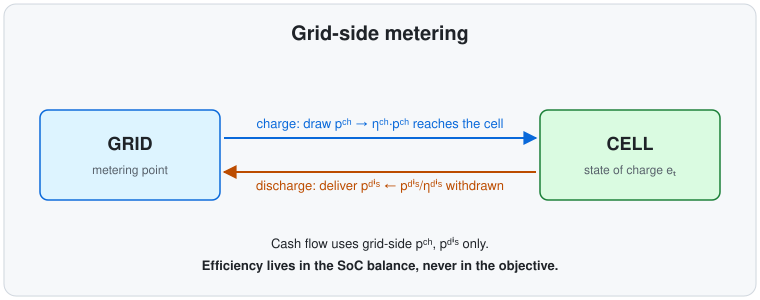

# BESS Dispatch Formulation

*The single source of truth for the optimization math.*

This file holds the canonical mathematics of the **deterministic** model: the physics, the wear cost, the feasibility conditions it implies, and the dual quantities read off a solved dispatch.
Uncertainty (forecast, scenarios, the two-stage program, bid curves) is in [formulation-uncertainty.md](formulation-uncertainty.md); measurement protocols are in [formulation-evaluation.md](formulation-evaluation.md).
Specs, the README, and ADRs **point here**; they never restate equations.
Each phase that changes the optimizer math appends a section; nothing is duplicated elsewhere.
Pure engineering / data-reliability phases (R1.4c ingestion guard, R1.5 serving, R2.1b drift monitor) introduce no optimizer math and intentionally have no section here.
Most theory here is standard optimization / MILP technique and carries no reference.
A few parts rest on a specific published method (see [references.md](references.md));
those name a source purely for traceability, where it earns its place.
References are the exception, not a per-section requirement.
Each section summarizes only the theory the project implements;
**house notation here and in [conventions.md](conventions.md) takes precedence** for shared quantities.

*Assumes: the house notation in [Conventions](conventions.md) (grid-side power, per-unit SoC, `π / e / η / Δt`).
Battery and power-market terms are defined in the [glossary](glossary.md); each section is self-contained, so read Conventions first.*

GitHub renders the `$$…$$` LaTeX below.

---

---

## Conventions

**Metering convention, the correctness trap:**
All power variables are measured at the **grid / AC terminal** (the metering point).
Efficiency therefore appears in the state-of-charge balance, and **never in the objective**:

- charging draws $p^{ch}_t$ from the grid, but only $\eta^{ch} p^{ch}_t$ reaches storage (charge losses);
- delivering $p^{dis}_t$ to the grid requires withdrawing $p^{dis}_t / \eta^{dis}$ from storage (discharge losses).

This is exactly the property-test invariant:

$$e_t = e_{t-1} + \eta^{ch} p^{ch}_t \Delta t - \frac{p^{dis}_t}{\eta^{dis}} \Delta t$$

The round-trip efficiency $\eta^{rt}=\eta^{ch}\eta^{dis}$ is **emergent**, not a separate term:
delivering 1 MWh to the grid ultimately costs $1/\eta^{rt}$ MWh drawn from the grid, enforced entirely by the balance above.

---

## Model at a glance

*A compact, one-screen statement of the full model.
This is an index, not a second source of truth:
the per-phase sections below (R1.1, R1.2, R2.3) are canonical and carry the derivations, rationale, and evolving detail; if the two ever disagree, the section governs.
Current through R2.3 (R2.4 adds explanation and R2.5 adds evaluation protocols; neither changes the optimizer).*

All power is metered **grid-side**, so efficiency enters only the SoC balance, never the objective (see [Conventions](#conventions) above).

**Periods and variables.**
Periods $t\in\{1,\dots,T\}$, step $\Delta t$ in hours.
Grid-side power $p^{ch}_t,p^{dis}_t\ge 0$; SoC $e_t\in[e_{\min},e_{\max}]$; charge indicator $u_t\in\{0,1\}$; degradation cost $D_t\ge 0$; net export $g_t\equiv p^{dis}_t-p^{ch}_t$.

**Objective** (R1.1 revenue minus R1.2 degradation):

$$\max\ \sum_{t}\Bigl[\pi_t \Delta t (p^{dis}_t-p^{ch}_t)\ -\ D_t\Bigr]$$

**Constraints** ($\forall t\in\mathcal T$):

| # | Constraint | Role |
| --- | --- | --- |
| (1) | $e_t = e_{t-1} + \eta^{ch}p^{ch}_t\Delta t - \tfrac{p^{dis}_t}{\eta^{dis}}\Delta t$ | SoC balance (efficiency lives here) |
| (2) | $e_{\min}\le e_t\le e_{\max}$ | SoC bounds |
| (3) | $0\le p^{ch}_t\le \bar P^{ch}u_t$, $0\le p^{dis}_t\le \bar P^{dis}(1-u_t)$ | power caps + no simultaneous charge/discharge |
| (4) | $-R\le g_t-g_{t-1}\le R$ ($t\ge 2$) | ramp on net power |
| (5) | $e_T=e^{\mathrm{tgt}}$ | terminal SoC |
| (6) | $D_t = c^{\text{deg}} \tau_t$ | linear wear cost on throughput (R1.2) |

with storage-side throughput $\tau_t=\eta^{ch}p^{ch}_t\Delta t+\tfrac{p^{dis}_t}{\eta^{dis}}\Delta t$ and marginal wear cost $c^{\text{deg}}$ (€/MWh; the linear DoD-stress case).
At $c^{\text{deg}}=0$ the term vanishes and the model is exactly R1.1.

**Stochastic layer (R2.3).** Optimize over a scenario set $\{(\pi^{(s)},p_s)\}_{s=1}^S$ instead of one price path. A non-anticipative day-ahead commitment $g^{DA}$ (R1.1-feasible) and a per-scenario recourse dispatch $g^{(s)}$ (R1.1-feasible) are tied by a recourse budget

$$\lvert g^{(s)}_t-g^{DA}_t\rvert\ \le\ \rho \bar P\qquad \rho\in[0,1],$$

under a CVaR mean-risk objective (risk weight $\lambda\in[0,1]$, tail level $\alpha$; loss $L_s=- \text{profit}_s$):

$$\max\ (1-\lambda)\sum_s p_s \text{profit}_s\ -\ \lambda \mathrm{CVaR}_\alpha(L).$$

$\lambda=0$ is the risk-neutral recourse problem; sweeping $\lambda$ traces the mean-CVaR frontier. The program reduces to the deterministic MILP at $S=1$, and reports VSS $=\mathrm{RP}-\mathrm{EEV}$ and EVPI $=\mathrm{WS}-\mathrm{RP}$ with the ordering $\mathrm{EEV}\le\mathrm{RP}\le\mathrm{WS}$.

**Solver.** A MILP throughout (the only integrality is $u_t$, and $u^{(s)}_t$ in the stochastic layer), solved by HiGHS via `appsi_highs`; no non-convex or SOS structure.

---

## R1.1. Deterministic core

*No governing reference:
standard MILP modeling.
House notation ([conventions.md](conventions.md)) governs; see [references.md: R1.1](references.md#r11-deterministic-milp-dispatch) for domain context.*

### Sets

- $t \in \mathcal{T} = \{1,\dots,T\}$: dispatch periods. $\Delta t$ = period length in hours (1.0 hourly, 0.25 quarter-hourly).

### Parameters

| Symbol | Meaning | Unit |
| --- | --- | --- |
| $\pi_t$ | day-ahead price in period $t$ (known) | €/MWh |
| $\Delta t$ | period length | h |
| $\eta^{ch}, \eta^{dis}$ | charge / discharge efficiency, $\in(0,1]$ | – |
| $\bar P^{ch}, \bar P^{dis}$ | max charge / discharge power | MW |
| $e_{\min}, e_{\max}$ | usable SoC bounds | MWh |
| $R$ | ramp limit on net power | MW per period |
| $e_0$ | initial SoC, $\in[e_{\min}, e_{\max}]$ | MWh |
| $e^{\mathrm{tgt}}$ | terminal SoC target, $\in[e_{\min}, e_{\max}]$ | MWh |

Both endpoint parameters must lie inside the SoC bounds (config validation enforces this); the R1.3 reachability proof relies on it.

### Decision variables

| Symbol | Meaning | Domain |
| --- | --- | --- |
| $p^{ch}_t$ | grid-side charging power | $\ge 0$ |
| $p^{dis}_t$ | grid-side discharging power | $\ge 0$ |
| $e_t$ | state of charge at end of $t$ | $[e_{\min}, e_{\max}]$ |
| $u_t$ | charge indicator (1 = charging) | $\{0,1\}$ |

### Objective

Maximize day-ahead arbitrage revenue (grid-side cash flow, no efficiency term):

$$\boxed{ \max \sum_{t \in \mathcal{T}} \pi_t \Delta t \bigl(p^{dis}_t - p^{ch}_t\bigr) }$$

### Constraints

**(1) State-of-charge balance** (with $e_0$ given as initial condition):

$$\boxed{ e_t = e_{t-1} + \eta^{ch} p^{ch}_t \Delta t - \frac{p^{dis}_t}{\eta^{dis}} \Delta t \qquad \forall t \in \mathcal{T} }$$

**(2) SoC bounds:**

$$\boxed{ e_{\min} \le e_t \le e_{\max} \qquad \forall t \in \mathcal{T} }$$

**(3) Power limits with mutual exclusion** (no simultaneous charge and discharge):

$$\boxed{ 0 \le p^{ch}_t \le \bar P^{ch} u_t, \qquad 0 \le p^{dis}_t \le \bar P^{dis} (1 - u_t) \qquad \forall t \in \mathcal{T} }$$

**(4) Ramp on net power** (for $t \ge 2$; $p^{net}_t \equiv p^{dis}_t - p^{ch}_t$):

$$\boxed{ -R \le p^{net}_t - p^{net}_{t-1} \le R \qquad \forall t \in \mathcal{T}, t \ge 2 }$$

**(5) Terminal SoC:**

$$\boxed{ e_{T} = e^{\mathrm{tgt}} }$$

### Modeling notes

- **Mutual-exclusion binary $u_t$.**

 **When prices are non-negative** ($\pi_t \ge 0$):
 The *LP relaxation* (integrality of $u_t$ dropped) self-enforces mutual exclusion automatically whenever $\eta^{rt}<1$.
    A simultaneous charge–discharge round trip loses energy with no revenue upside, so the relaxed *dispatch* is already exclusion-feasible without branching.
 ($u_t$ itself may relax to a fractional value; what matters is that the dispatch it gates is integral in its own right.)

 **When prices turn negative** ($\pi_t < 0$, a *recurring* BE/NL condition):
    The binary becomes a first-class correctness requirement, not a nicety.
    At negative prices, simultaneous charging and discharging looks profitable to the LP: it burns grid energy, and a negative price means the market pays the battery to do so.
    But this round trip holds SoC fixed while drawing energy through the cell, which the balance constraint forbids: it is infeasible, and only the binary rules it out.
 Most sub-zero hours still relax cleanly, so $u_t$ rarely binds, but enough do not that it is essential, chiefly when a negative price coincides with a saturated SoC (no room left to store the cheap energy).

    **Big-M structure:**
    Constraint (3) is a big-M switch: its right-hand side relaxes to a large constant when its binary is off.
 Here the constant is the tightest valid bound: the power cap itself ($\bar P^{ch}, \bar P^{dis}$), so no loose big-M is introduced and the relaxation remains tight.

- **Ramp.**
    Defined on net power for generality / grid-connection.
 Batteries ramp near-instantly, so $R$ is typically non-binding; disable by setting $R \ge \bar P^{ch} + \bar P^{dis}$.
 Note that a tight $R$ constrains the charge→discharge *transition* (a flip from $-\bar P^{ch}$ to $+\bar P^{dis}$ is a swing of $\bar P^{ch}+\bar P^{dis}$), so keep $R$ disabled for the R1.1 oracles unless a transition profile is being tested explicitly.
- **Physics fidelity (deliberately shallow).**
    The cell model is kept LP/MILP-friendly on purpose:
    constant charge/discharge efficiency, no self-discharge, no temperature or SoC-dependent effects, and (in R1.2) a throughput *proxy* for wear rather than a fatigue model.
    Two reasons govern this.
    First, on a day-ahead horizon the price-forecast error dwarfs the battery-model error, so extra cell fidelity buys second-order revenue against a first-order uncertainty;
    the R2 forecaster / stochastic layer is where accuracy actually pays.
    Second, the tempting refinements are non-convex:
    SoC-dependent efficiency is bilinear, and rainflow wear is path-dependent (both in the R1.2 out-of-scope list), so either would trade a fast, provably-optimal solve for a slow, locally-optimal one.
    Cheap, convexity-preserving additions (a linear self-discharge decay in balance (1); a 2-to-3-segment PWL efficiency curve) are held back until a real asset demands them.
    This mirrors production dispatch practice, where the modeling budget is spent on market scope and uncertainty, not cell chemistry.
- **Price-taker (reflexivity out of scope).**
    The price path $\pi_t$ is an exogenous parameter: dispatch $g_t$ optimizes against it and never feeds back into it. This standard price-taker assumption holds for the study asset (2 MWh / 1 MW), far too small to move day-ahead clearing in a bidding zone that trades in the gigawatts.
    Worth naming what it sets aside, since a day-ahead price is not a physical signal but the clearing point of an auction, the outcome of many agents' strategic bids: the model forecasts that outcome as a given series (R2.1) and does not model the game producing it.
    It would break for a participant large enough that its own bids move the price it is forecasting (reflexivity), where dispatch and price co-determine and the honest model carries an endogenous price (a residual supply curve); that is out of scope here and the natural home of the R3 price-impact work.
    A **bid curve** is a separate matter, and not a market-power one: the clearing price is unknown at gate closure, so what a participant submits per hour is a monotone set of (price, quantity) pairs that the auction resolves into a dispatch, which means even a price-taker submits a curve rather than a schedule. That is uncertainty handling over the R2.2 scenario set, so it belongs with the R2 stochastic layer rather than with reflexivity.
- **Sense.**
    Pyomo minimizes by default;
    set the objective sense to maximize (or minimize the negated expression).

### Worked example (sanity, $\eta = 1$)

$T=3$, $\pi=[10,50,20]$, $\Delta t=1$, a 1 MWh / 1 MW battery (energy capacity / power rating, a 1-hour, i.e. 1C, asset), $e_0=e^{\mathrm{tgt}}=0$, $R$ disabled → charge at $t_1$, discharge at $t_2$, idle at $t_3$; objective $=40$.
The full oracle set (including the lossy and no-trade cases) is the test contract in [specs/R1.1-deterministic-core.md](specs/R1.1-deterministic-core.md).

---

## R1.2. Degradation cost

*Governing reference:
the **linear DoD-stress** case of the Xu/Shi cycle-aging degradation model (see [references.md: R1.2](references.md#r12-degradation-cost) for the source list and scope).*

Extends R1.1 by subtracting a **degradation cost** from the objective.
All R1.1 sets, variables, and constraints (1)–(5) are unchanged; the SoC balance and grid-side metering are untouched.
Degradation is a cost on cell usage, never an efficiency factor, and it does not enter the SoC balance.
At zero wear cost the term vanishes and the model reduces to R1.1 exactly.

### Degradation measure and cost

The project prices wear as a **linear cost on cell throughput**, the *linear power-based* degradation model (Shi 2017 §II-C-1).
Define per-period **storage-side throughput**, the cell-side energy moved in both directions:

$$\boxed{ \tau_t = \eta^{ch} p^{ch}_t \Delta t + \frac{p^{dis}_t}{\eta^{dis}} \Delta t }$$

Charge and discharge are mutually exclusive in a period (R1.1 binary $u_t$), so at most one term is non-zero.
The per-period degradation cost is linear in throughput:

$$\boxed{ D_t = c^{\text{deg}} \tau_t \qquad \forall t\in\mathcal T }$$

| Symbol | Meaning | Unit |
| --- | --- | --- |
| $c^{\text{deg}}$ | marginal wear cost per unit storage-side throughput (Shi 2017 §II-C-1) | €/MWh |
| $D_t$ | degradation cost incurred in period $t$ | € |

$c^{\text{deg}}$ is an operating parameter, set from the cell **replacement cost divided by lifetime energy throughput** (standard arbitrage practice); reported values sit in roughly **€7–15/MWh** of throughput.
It is a cell-chemistry property:
independent of the asset's power and energy ratings, and, because it multiplies a total-throughput sum, independent of the time step $\Delta t$.
The linear cost is native to the LP: no auxiliary breakpoints, cuts, or special-ordered sets are needed.

**Grounding (why this is the cited model, not a shortcut).**
Xu (2018) and Shi (2017) model cell aging as a sum $c^{\text{rep}}\sum_i\Phi(d_i)$ over charge/discharge cycle depths $d_i$ (SoC ranges extracted by the **rainflow** algorithm), where $\Phi$ is the depth-of-discharge stress function and $c^{\text{rep}}$ the cell replacement cost.
Shi (2017 §II-C-1) shows the **linear** stress $\Phi(d)=k_1 d$ "is equivalent to the linear power-based degradation model": the total cost then depends only on total throughput, independent of how it partitions into cycles, so rainflow drops out and the cost is exactly the $D_t=c^{\text{deg}}\tau_t$ above.
The richer nonlinear-$\Phi$ case is more accurate but not LP-native; it is future work below.

### Modified objective

$$\boxed{ \max\ \sum_{t\in\mathcal T}\Bigl[\pi_t \Delta t (p^{dis}_t-p^{ch}_t)\ -\ c^{\text{deg}} \tau_t\Bigr] }$$

Revenue is unchanged and still carries **no efficiency term**; the only addition is the subtracted linear wear cost.

### Properties (gate-relevant)

- **$\Delta t$-invariant.**
 $\sum_t \tau_t$ is the total energy through the cell over the horizon, unchanged by the time discretization, so a fixed physical dispatch costs the same at hourly or quarter-hourly resolution (gate: equal total degradation at $\Delta t=1$ and $\Delta t=0.25$).
- **Spec-invariant.**
 $c^{\text{deg}}$ (€/MWh) is a chemistry property: replacement cost and lifetime throughput both scale with capacity, so their ratio does not.
    The marginal wear cost is therefore independent of the asset's power and energy ratings.
- **Monotone.**
 $c^{\text{deg}}\ge0$, so more throughput never lowers cost.
- **Reduces to R1.1** at $c^{\text{deg}}=0$.

### Out of scope (referenced future work)

- **Nonlinear convex DoD stress (the more accurate model).**
    Real cells age faster per unit energy the deeper the cycle:
    an NMC cell loses roughly **ten times** more life at 100% depth-of-discharge than at 10% for the same charged energy (Shi 2017 §I; Xu 2017 §II).
    The linear cost above misses this deep-cycle penalty.
 Capturing it uses a convex nonlinear stress $\Phi(d)=k_2 d e^{k_3 d}$ or $k_4 d^{k_5}$ (Xu 2018), still convex in the SoC profile (Shi 2017, Thm 1) but requiring rainflow cycle identification, which has no closed form.
 It is therefore convex yet **not LP-representable**: solvable by Shi's subgradient method, or by a cycle-detection MILP in which a convex-PWL **epigraph** linearization of $\Phi$ (Williams; [references.md: R1.2](references.md#r12-degradation-cost)) embeds the segments.
    Deferred to keep the LP/MILP core; the linear case is the gate-testable stand-in.
- **Calendar aging** (time-based capacity fade). Deferred.

### Worked example ($\eta=1$)

$T=2$, $\pi=[0,50]$, $\eta^{ch}=\eta^{dis}=1$, a 1 MWh / 1 MW battery, $e_0=e^{\mathrm{tgt}}=0$, $\Delta t=1$. Terminal $=0$ forces discharge $=$ charge $=q$, so $\tau=q$ in each period and the objective is $f(q)=50q-2c^{\text{deg}}q$.

- At $c^{\text{deg}}=10$ €/MWh: $f(q)=30q$, increasing, so $q^\star=1$ → charge $[1,0]$, discharge $[0,1]$, soc $[1,0]$, objective $=\mathbf{30}$.
- At $c^{\text{deg}}=30$ €/MWh: $f(q)=-10q$, so $q^\star=0$ (idle), objective $=\mathbf{0}$: wear exceeds the €50 round-trip spread. The breakeven is $c^{\text{deg}}=25$ €/MWh.

The full oracle set (including the storage-side $\eta<1$ case) is in [specs/R1.2-degradation.md](specs/R1.2-degradation.md).

---

## R1.3. Pre-flight feasibility (derived; no new model)

*No governing reference; engineering phase, **no new theory**.
The conditions below are algebraic corollaries of the R1.1 model.
See [references.md: R1.3](references.md#r13-pre-flight-validation).*

This section adds **no constraints, variables, or objective terms**.
It records the closed-form feasibility test the validation layer
([specs/R1.3-validation.md](specs/R1.3-validation.md)) evaluates *before* the solver.
If the code and this derivation ever disagree, this governs.

### Per-period SoC increment bounds

From balance (1), each step changes SoC by $\Delta e_t \equiv e_t - e_{t-1} = \eta^{ch} p^{ch}_t \Delta t - \tfrac{p^{dis}_t}{\eta^{dis}} \Delta t$.
Power limits (3) with mutual exclusion (one direction per period) bound it by

$$\boxed{ -\Delta^- \le \Delta e_t \le \Delta^+, \qquad \Delta^+ \equiv \eta^{ch}\bar P^{ch}\Delta t, \quad \Delta^- \equiv \frac{\bar P^{dis}\Delta t}{\eta^{dis}}. }$$

The efficiency placement mirrors the SoC balance (1);
$\Delta e_t$ is the *cell-side* increment, so charging multiplies by $\eta^{ch}$ (only part of the grid-side power reaches the cell) while discharging divides by $\eta^{dis}$ (more must leave the cell than reaches the grid).
The extremes are attained one direction at a time, so mutual exclusion does not shrink the interval.

### Terminal reachability

With $e_0$ given and the terminal condition (5) $e_T = e^{\mathrm{tgt}}$, write $\Delta \equiv e^{\mathrm{tgt}} - e_0$.
Summing the increment bounds over the $T$ periods, and noting the endpoint box bounds $e_0, e^{\mathrm{tgt}} \in [e_{\min}, e_{\max}]$ hold by construction, a feasible
trajectory through (1)–(3),(5) exists **iff**

$$\boxed{ - T \Delta^- \le \Delta \le T \Delta^+ \qquad\text{(ramp-free).} }$$

*Sufficiency:*
charge (or discharge) at the per-period extreme until $e^{\mathrm{tgt}}$ is hit, then idle, a monotone path that never leaves $[e_{\min}, e_{\max}]$ because both endpoints lie inside it.
*Necessity:* the net change cannot exceed the summed per-period bounds.
Violating the upper bound is unreachable-by-charging; the lower, unreachable-by-discharging.

### Ramp interaction

Adding ramp (4) only *further* restricts the admissible $\Delta e_t$ sequence, so the inequality above remains **necessary** (a violation is still infeasible) but is **no longer sufficient**:
a tight $R$ can make a nominally reachable target infeasible.
Pre-flight therefore tests the ramp-free condition only (a sound fast filter) and leaves ramp-coupled infeasibility to the solver's optimality check.

---

## R2.4. Shadow-price explainability (derived; no optimizer change)

*No governing reference; standard LP duality.
The water value and no-trade band below are algebraic corollaries of R1.1/R1.2 stationarity, not imported.
The term "water value" is borrowed from hydro-thermal scheduling as context only; see [references.md: R2.4](references.md#r24-shadow-price-explainability).*

This section adds **no constraints, variables, or objective terms**.
It records the dual quantities the explainability layer ([specs/R2.4-explainability.md](specs/R2.4-explainability.md)) reads off the *solved* R1.1/R1.2 dispatch. If the code and this derivation ever disagree, this governs.

**A MILP has no duals, so fix-and-resolve.** The dispatch is a MILP (the binary $u_t$, constraint (3)), which has no LP dual. Take the optimal commitment $u^\star$, fix it, and re-solve the resulting LP; its duals are the reported values. Fixing $u=u^\star$ restricts the feasible set to a subset that still contains the MILP optimum, so the LP optimum equals it exactly, and the duals are valid for perturbations too small to change $u^\star$.

### The water value

Let $\mu_t$ (€/MWh) be the dual of the SoC balance (1). It is the marginal value of one extra MWh stored at the end of $t$: $\mu_1 = \partial V^\star/\partial e_0$. Stationarity in $e_t$ gives $\mu_t = \mu_{t+1} + \beta_t$, where $\beta_t$ is the net SoC-bound multiplier at $t$, so

$$\boxed{ e_{\min} < e_t < e_{\max} \implies \mu_t = \mu_{t+1}. }$$

The water value is **flat while SoC is interior** and steps only where the battery hits a bound, so one number explains a whole run of periods.

**$\mu$ belongs to the chosen optimum, not to the price path.** Where $V^\star$ has a kink in $e_0$ its subdifferential is an interval and every point of that interval is a valid marginal value; where the *primal* optimum is non-unique, two equally optimal dispatches report different endpoints of it. A worked instance: $\pi=[0,-1,-1,0,0,0]$ on a 0.75 MWh / 2 MW asset ($\eta=1$, $e_0=e^{\mathrm{tgt}}$ half full, $\Delta t=0.5$) empties at $t_1$ and is then paid to absorb one full charge, which it can take at $t_2$ **or** $t_3$ for the same objective; the plan that charges at $t_2$ reports $\mu_2=-1$ and the plan that idles there reports $\mu_2=0$. So a claim of the form "$\mu$ is invariant under a transformation that leaves the price path alone" holds **only where the transformation leaves the dispatch alone**, which is the same kink caveat the finite-difference check carries. The tie-break invariance of [the MILP dual re-solve rule](decisions/milp-dual-resolve-rule.md) detects the ambiguity only when it surfaces as a negative-priced idle period; a plan that trades through the kink cannot see it.

### The no-trade band

Stationarity in $p^{ch}_t, p^{dis}_t$ with the R1.2 wear $D_t = c^{deg}\tau_t$ gives the sign conditions $p^{ch}_t > 0 \implies \pi_t \le \eta^{ch}(\mu_t - c^{deg})$ and $p^{dis}_t > 0 \implies \pi_t \ge (\mu_t + c^{deg})/\eta^{dis}$, so the battery idles exactly when

$$\boxed{ \eta^{ch}\bigl(\mu_t - c^{deg}\bigr) \le \pi_t \le \frac{\mu_t + c^{deg}}{\eta^{dis}}. }$$

The band's width is created by round-trip loss and wear, not by the price; at $\eta^{rt}=1, c^{deg}=0$ it collapses to $\pi_t = \mu_t$ (exact indifference). A **transaction cost** $\kappa$ per grid-side MWh widens it flat by $\kappa$ on each side (outside the $\eta$ factors, as a market fee on grid energy, unlike the $\eta$-scaled wear), giving a per-trade **breakeven slippage** (the margin by which an executed trade clears its $\kappa=0$ threshold, $\ge 0$ by optimality). This is a read-off from the solved schedule, not a re-optimization: it changes no objective term.

### The idle tie-break (gate-critical)

At an idle period both $u_t=0$ and $u_t=1$ are optimal, and constraint (3) gates each direction on $u_t$, so the solver's arbitrary tie-break moves the reported $\mu_t$. The shipped rule **relaxes both exclusion caps to the natural power caps $\bar P^{ch}, \bar P^{dis}$ at idle periods with $\pi_t \ge 0$** (which imposes both band edges at once and recovers $\partial V^\star/\partial e_0$), keeps $u^\star$ fixed at negative-priced idle periods, and **asserts the re-solved LP objective equals the MILP's** on every solve ([the MILP dual re-solve rule](decisions/milp-dual-resolve-rule.md)). The restriction is necessary: at $\eta^{rt}<1$ a freed idle period at a negative price runs a SoC-neutral round trip the market pays for, which R1.1's exclusion forbids, so the relaxed LP would beat the MILP by $\sum_{t\text{ idle},\pi_t<0}\lvert\pi_t\rvert(1-\eta^{ch}\eta^{dis})\bar P\Delta t$; the equality assertion is the guard. A band is reported only where $\mu_t$ is **tie-break invariant** (both tie-breaks agree, tested with one extra LP), a property of the flat run.

### Worked example (ties to golden oracle 1)

$T=3$, $\pi=[10,100,200]$, a 1 MW / **2 MWh** battery, $e_0=e^{\mathrm{tgt}}=0$, $\eta=1$, ramp off, no wear. The MILP charges at $t_1$, **idles at $t_2$**, discharges at $t_3$; objective 190. The water value is $\mu=[100,100,100]$ (SoC stays interior, so it is flat), equal to $\partial V^\star/\partial e_0=100$: a marginal stored MWh clears at $t_2$'s price, not $t_3$'s (power is already capped at $t_3$). The two rejected tie-break rules report 200 and 10 at the *same* objective 190, which is why oracle 1 pins the rule. Breakeven slippage is $100-10=90$ at the charge and $200-100=100$ at the discharge.

**Considered but out of scope:** duals of the R2.3 two-stage program (a different object, pricing the recourse budget); parametric ranging (how far $\pi_t$ moves before $u^\star$ changes); a transaction cost as an *objective term* (re-optimizing under $\kappa$, its own future delta, distinct from the read-off above); Benders / L-shaped decomposition; bid-curve construction from the water value (R3).

---

## Companion files

The math is split by **subject**, not by release, and each file is canonical for its own:

| File | Subject |
| --- | --- |
| **This file** | The deterministic model: conventions, physics, wear, feasibility, and the duals read off a solved dispatch |
| [formulation-uncertainty.md](formulation-uncertainty.md) | Not knowing the price: the conformal forecast, the scenario representation, the risk-aware two-stage program, and the bid curve |
| [formulation-evaluation.md](formulation-evaluation.md) | What a reported number means: the backtest information set and revenue ordering, and the out-of-sample value protocols |

The changelog below covers all three.

---

## Changelog

- **R1.1**: deterministic core.
- **R1.2**: degradation cost subtracted from the objective, the **linear DoD-stress** case of the Xu 2018 / Shi 2017 cycle-based model (equivalently a linear power-based cost): $D_t = c^{\text{deg}}\tau_t$ on storage-side throughput, $\Delta t$-invariant and independent of the asset's power / energy ratings. R1.1 sets / variables / constraints and the SoC balance unchanged; reduces to R1.1 at $c^{\text{deg}}=0$. Nonlinear convex $\Phi$ (rainflow; convex but not LP) is referenced future work.
- **R1.3**: pre-flight feasibility *corollaries* of R1.1 (per-period increment bounds → terminal reachability); **no model change**. Ramp-free condition is necessary-and-sufficient; with ramp it stays necessary (sound filter), solver remains final arbiter.
- **R1.4**: backtest *semantics* over the existing optimizer (perfect-foresight ceiling, rolling per-day deployable value, greedy floor; provable ordering $V^{\mathrm{greedy}}\le V^{\mathrm{roll}}\le V^\star$; leakage information set; sanity band); **no model change**.
- **R2.1**: probabilistic price *forecast* (split/CQR conformal intervals with a distribution-free marginal-coverage guarantee); the uncertainty input to the R2 stochastic layer. **No optimizer change**: adds no constraint, variable, or objective term to the dispatch MILP.
- **R2.2**: scenario *generation* (residual-path bootstrap off the R2.1 forecast) + *reduction* (Kantorovich-distance forward selection with probability redistribution; k-means baseline); the discrete uncertainty representation the R2.3 program optimizes over. **No optimizer change**: adds no constraint, variable, or objective term to the dispatch MILP.
- **R2.3**: risk-aware two-stage dispatch over the scenario set + intraday recourse. **Optimizer delta** (the first in Release 2): a non-anticipative day-ahead commitment $g^{DA}$, per-scenario recourse dispatch $g^{(s)}$ (R1.1 physics reused) tied by a recourse budget $\lvert g^{(s)}-g^{DA}\rvert\le\rho\bar P$, and a CVaR mean-risk term (Rockafellar-Uryasev linearisation, weight $\lambda$). Reports VSS $=\text{RP}-\text{EEV}$ and EVPI $=\text{WS}-\text{RP}$ with the ordering $\text{EEV}\le\text{RP}\le\text{WS}$ (extends R1.4). Reduces to the R1.1/R1.4 deterministic solve at $S=1$; the VSS $=0$ collapse is reproduced at the $\rho$-limits. Stays a MILP on HiGHS, no new dependency.
- **R2.4**: shadow-price *explainability* over the solved R1.1/R1.2 dispatch (the SoC-balance dual as a water value, its flatness on interior SoC, the no-trade band, a per-trade breakeven-slippage read-off). **No optimizer change**: adds no constraint, variable, or objective term. MILP duals via fix-and-resolve; the idle tie-break is resolved by relaxing the exclusion caps at $\pi_t\ge 0$ idle periods with an objective-equality guard, bands reported only where $\mu_t$ is tie-break invariant ([the MILP dual re-solve rule](decisions/milp-dual-resolve-rule.md)).
- **Errata (2026-07-08)**: R1.4 ordering restated as $V^{\mathrm{greedy}} \le V^{\mathrm{roll}} \le V^\star$ with $0 \le V^{\mathrm{roll}}$ (the old display's $0 \le V^{\mathrm{greedy}}$ contradicted the greedy-can-lose-money note); sanity-band coefficient corrected to $c=\eta^{rt}(\text{cycles/day})\cdot 365$ ($E_{\text{usable}}$ wrongly appeared on both sides); R2.1 notation reconciled ($[\underline{\pi}_t,\overline{\pi}_t]$, margin $\hat s$). No model change.
- **R2.5**: value evaluation *hardening* over the existing R2.3 program (per-window out-of-sample VSS as a distribution over real UTC-day windows under the [the recourse and out-of-sample protocol](decisions/risk-aware-two-stage-design.md) protocol; the forecast-value baseline FV contrasting conformal vs. seasonal-naive scenario inputs in euros, closing R2.3's deferred loop; pinball loss + skill ratio at the R2.1 interval edges). **No optimizer change**: adds no constraint, variable, or objective term. VSS windows and FV are reported, not sign-asserted (out-of-sample honesty per [the recourse and out-of-sample protocol](decisions/risk-aware-two-stage-design.md)).
- **R2.1e (2026-07-28)**: optional **normalized target** for the R2.1 forecaster. **No optimizer change and no new guarantee**: the learner is fit on $(\pi_t - m_t)/s_t$ for a trailing level and scale known at gate closure, and predictions and both interval bounds are mapped back by a strictly increasing affine map, so R2.1's marginal coverage is *inherited* rather than re-derived. The point is the *conditional* miscalibration the marginal guarantee permits: width in price space becomes proportional to the recent scale. De-levelling is additive, never a log or ratio, because a material share of hours clear at or below zero. §R2.1 gains the statement and its inversion argument.
- **R2.1d (2026-07-28)**: walk-forward *evaluation* hardening for the R2.1 coverage claim. **No optimizer change, and no change to the coverage guarantee itself**: what changed is how it is tested. Folds are placed across the whole evaluation span with a fixed-length rolling training window (R2.1 tiled the last $n_{\text{folds}}\cdot n_{\text{test}}$ days, putting every fold inside one fortnight), and the $\pm 0.05$ tolerance is now decided by a day-block bootstrap interval rather than by a point estimate, because coverage indicators cluster within a day so the effective sample is the evaluated day count. Sharpness (pinball loss vs. seasonal naive) joins coverage as a gated axis. §R2.1's gate paragraph restated accordingly.
- **R1.2 model change (2026-07-11)**: degradation regrounded. The earlier convex-PWL-of-throughput cost (epigraph form) was self-derived and matched no published source; replaced by the **linear DoD-stress** case of the cited cycle-based model (Xu 2018; Shi 2017 §II-C-1), a linear €/MWh throughput cost that is $\Delta t$-invariant (fixes a resolution dependence exposed by 15-min data) and asset-scale-invariant. Governing reference updated in [references.md](references.md); implementation (config, code, golden oracles) follows.
- **R2.6**: price-contingent day-ahead **bid curves**. **Optimizer delta**: the first stage is indexed by scenario and constrained to be monotone in, and single-valued in, each hour's clearing price, so the commitment is measurable with respect to that price alone (a submittable curve $q_t$) instead of one schedule shared across scenarios. Both legs settle at the realized clearing price. Forcing all branches equal reproduces §R2.3 exactly at $\lambda=0$, and the curve dominates it there; at $\lambda>0$ the two differ by design (§R2.3's fixed-price leg is a forward hedge, an auction leg is not). R1.1 physics, the recourse budget, and the CVaR term are unchanged. Carries its own **evaluation semantics**: a curve's realized commitment is assembled across branches, so it is not an R1.1 schedule, and it is scored as a cash-flow obligation entering only the recourse budget, with the unpriced **delivery gap** reported beside any value number.
- **R2.4 clarification (2026-07-26)**: $\mu$ is a property of the *chosen* optimum, not of the price path. At a kink of $V^\star$ the subdifferential is an interval, and where the primal optimum is non-unique two equally optimal dispatches report different endpoints of it, so invariance claims about $\mu$ hold only where the dispatch is also invariant. No model change; the scale-invariance property gained the condition and a golden oracle now pins a measured instance.
- **Split (2026-07-26)**: the Release-2 sections moved to a companion file at the 600-line cap; no math changed. §R1.1's price-taker note was corrected at the same time to separate price *impact* (reflexivity, R3) from a *bid curve* (price contingency under uncertainty, §R2.6), which one sentence had conflated.
- **Recut by subject (2026-07-28, spec S1)**: **no math changed and no section body was edited.** The earlier split was by *release*, which cut through the subject: §R2.4's water value is the dual of §R1.1's SoC balance and belongs beside it, while §R1.4's revenue ordering is measurement protocol and belongs beside §R2.5's. The three files are now [formulation.md](formulation.md) (the deterministic model and its duals: §R1.1, §R1.2, §R1.3, §R2.4), [formulation-uncertainty.md](formulation-uncertainty.md) (§R2.1, §R2.2, §R2.3, §R2.6), and [formulation-evaluation.md](formulation-evaluation.md) (§R1.4, §R2.5). Section numbers keep their historical phase labels, so every existing cross-reference resolves to the same mathematics in a new home. `scripts/lint_docs.py` gained a check that binds a `formulation*.md §R<n>.<m>` reference, anywhere in the repository, to a section that actually exists.
