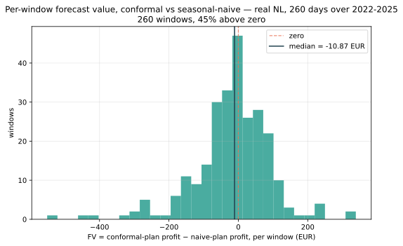

# Forecast value: does a better forecast earn more euros?

**Answer: null, in two markets and across four years.** Over 260 delivery days the
forecast-value distribution has a **median of −6.20 EUR per window on NL** (95% window
interval [−21.54, +5.17], 47% of windows positive) and **−11.67 EUR on BE**
([−27.26, +2.29], 44% positive). Both intervals contain zero, despite the conformal
forecaster having clear and measured statistical skill over the seasonal-naive
baseline it is compared against.

The NL figure is the mean over six random seeds, spanning [−11.54, −0.35]; the default
`seed=0` gives −10.87, second-lowest of the six. This study's seed drives the forecaster
fit as well as the scenario draws, so it carries about twice the draw noise of the
[stochastic-value](stochastic-value.md) study: an 11.19 EUR spread against that study's
4.85 ([R2.8](../specs/draw-noise.md)).

*Measured live on 2026-07-29 over real NL and BE day-ahead prices, 260 days in 52
blocks spread over 2022-01-01 to 2025-09-29, the same days and asset as the
stochastic-value study.*

Governing specs: [R2.5](../specs/value-evaluation.md) for the method,
[R2.7](../specs/study-windowing.md) for the window set; math:
[formulation-evaluation.md § R2.5](../formulation-evaluation.md).

## What changed: the null held, and softened

This page previously reported **−19.81 EUR, 41% positive** on one Dutch spring. The
finding survives a much wider window, but the magnitude does not: on 260 days across
four years it is −10.87, and the interval straddles zero.

| Measurement | Median | Share > 0 |
| --- | --- | --- |
| Published (Mar-Jun 2024) | −19.81 | 41% |
| Same window, after a seeding fix | −16.08 | 35% |
| 260 days over 2022-2025, `seed=0` | −10.87 | 45% |
| 260 days, mean over six seeds | **−6.20** | 47% |

Both corrections push the same way, toward zero. The old figure was the pessimistic end
of a range rather than its centre, and calling forecast value "mildly negative" claimed
more than the evidence supports. **Null is the right word, and now it is a null measured
on two markets.**

## The question

The forecaster is demonstrably better by statistical measures: calibrated 90%
intervals, and pinball loss at the interval edges running **0.22x / 0.28x** a
seasonal-naive baseline's, measured on the identical 260 days scored below. The question this study
asks is the one that actually matters to the asset: does that skill convert into
dispatch euros?

Holding a forecast layer to a euro standard rather than a statistical one is the
point. A project can improve pinball loss indefinitely without the battery
earning a cent more.

## Method

Feed the *same* two-stage dispatch two scenario sets that differ only in the
forecast behind them: conformal versus seasonal-naive, with the forecaster refit
walk-forward. Compare realized-path profit per window.

Each commitment settles its day-ahead leg at its **own** mean, so each forecaster
is held to the price basis it believed in. The metric is antisymmetric in its two
inputs and returns exactly zero when they are identical, which is pinned by a
property test.

## Result



Single windows swing hundreds of euros either way, which is why no single-window
number is quoted anywhere in this project. Quoting one would be cherry-picking from a
distribution whose centre is at best zero.

### A null is not a flat line

| Year | NL median | BE median |
| --- | --- | --- |
| 2022 | −17.97 | −15.79 |
| 2023 | **+8.08** | **+8.16** |
| 2024 | −12.08 | +1.48 |
| 2025 | −17.33 | **−48.52** |

The pooled null hides real structure. **2023 is positive in both markets**, and BE 2025
is strongly negative with an interval entirely below zero and only 24% of windows
positive. So forecast value is not reliably zero every year; it is a quantity that
wanders either side of zero with no dependable sign, which is what "no usable edge"
looks like in practice.

Two markets agreeing on the pooled null, while disagreeing year by year, is the
strongest available evidence that the null is about the **mechanism** rather than about
Dutch prices. As with the sister study, these per-year rows rest on about 70 windows
each and should be read with that in mind.

The seed sweep says the same thing from another angle: the median moves by a factor of
33 across six seeds, from −11.54 to −0.35, yet **every seed is negative and none reaches
50% of windows positive**. The euro figure is soft; the absence of an edge is not.

## Why

The scenario spread plus intraday recourse already hedge day-shape error. By the
time the point forecast would have paid off, the recourse has re-dispatched
against the realized price and captured the same value without it.

This is the first appearance of the mechanism that also produced the
[tail](tail-value.md) and [bid-curve](bid-curves.md) nulls: **recourse adjusts
after the price is known**, so a better day-ahead picture has little left to buy.

## What this does not say

It does not say the forecaster is worthless. It says its *marginal* dispatch value
over a seasonal-naive baseline, on this asset and this window, is not
distinguishable from zero. The forecaster still supplies the calibrated spread the
scenarios are drawn from, and the [stochastic structure](stochastic-value.md)
built on those scenarios does earn real money.

The honest claim is exactly that split: the structure pays, the sharper forecast
does not yet.

Nor does it say the forecaster is unnecessary. Its calibrated intervals are what the
scenario set is built from, so removing it would not leave the stochastic layer intact.
What is null is the **marginal** euro value of making it more accurate than a
seasonal-naive baseline, given a recourse layer that re-dispatches once prices are
known.

## Reproduce

```bash
uv run --group examples python examples/vss_study.py --mode full
```

Needs an ENTSO-E token and the `forecast` dependency group. The gated re-measurement
over both zones is a separate deliberate run:

```bash
uv run pytest -m "integration and studies" -s
```
