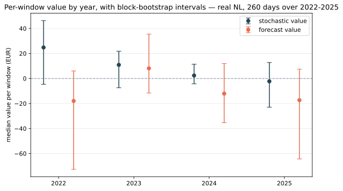
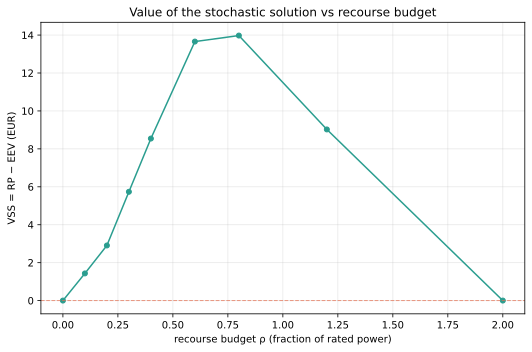
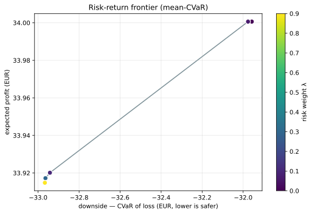

# Stochastic value: does hedging beat the mean forecast?

**Answer: yes in Belgium, and not decisively in the Netherlands.**
Over 260 delivery days spread across four years, the two-stage stochastic commitment
beat the mean-value plan by a median of **+8.36 EUR per window on BE** (95% window
interval [+4.57, +13.27], positive on 64% of windows) and **+5.76 EUR on NL**, whose
window interval **includes zero**. Both are for a 2 MWh / 1 MW asset at a 0.5 recourse budget.

The NL figure is the mean over ten random seeds, which span [+3.04, +7.89]; the default
`seed=0` gives +3.56, near the bottom of that range. Reporting the mean rather than one
seed is [R2.8](../specs/draw-noise.md): the scenario draw is itself random, and a single
run is a lucky or unlucky sample of it.

*Measured live on 2026-07-29 over real NL and BE day-ahead prices, 260 days in 52
blocks spread over 2022-01-01 to 2025-09-29.*

Governing specs: [R2.5](../specs/value-evaluation.md) for the method,
[R2.7](../specs/study-windowing.md) for the window set; protocol:
[the recourse and out-of-sample protocol](../decisions/risk-aware-two-stage-design.md); math:
[formulation-evaluation.md § R2.5](../formulation-evaluation.md).

## What changed, and why the headline moved

This page previously claimed **+12.90 EUR, positive on 66% of 94 windows**, measured
over one contiguous Dutch spring. That number is reproducible and was not wrong; it was
narrow. [R2.7](../specs/study-windowing.md) re-measured the same protocol on 260 days
spread across 2022 to 2025 and split the move into two parts:

| Measurement | Median | Share > 0 |
| --- | --- | --- |
| Published (Mar-Jun 2024) | +12.90 | 66% |
| Same window, after a seeding fix | +9.12 | 60% |
| 260 days over 2022-2025 | +3.56 | 56% |

About 4 EUR of the drop is the **seeding fix**: windows used to draw their training
scenarios from a generator walked in series order, so a day's result depended on how
many days preceded it in whichever series it arrived in. The rest is the **window**.

Two honest consequences. The stochastic edge is real but **smaller than one Dutch
spring suggested**, and on NL alone it is no longer separable from zero. And a claim
of this size carries Monte Carlo noise worth about 4 EUR from the scenario draw alone,
which nothing here has yet measured; see [limitations](#what-this-does-not-say).

## The question

The value of the stochastic solution (VSS) is the classical Birge-Louveaux answer
to "was the scenario machinery worth building?": the recourse-problem value minus
the value of the plan you get by optimizing against the mean forecast. A single
positive VSS on a designed instance proves only that the mechanism exists. This
study asks whether it survives on real days.

## Method

Each window is one UTC day. Commitments are fitted on the trailing 28 days, then
scored **fixed** on that day's realized prices, so nothing at or after the window
enters the fit. Both the stochastic (RP) and mean-value (EV) commitments are
scored the same way, with optimal within-budget intraday recourse.

Fitting and scoring being separate is the whole point: an in-sample VSS is
guaranteed non-negative by construction and would prove nothing.

The 260 days are **52 blocks of 5**, spread evenly across the span rather than taken
consecutively, which is the same fold layout the price forecaster is evaluated on. Two
reasons: consecutive days share 27 of their 28 training days, so a contiguous run of
them carries far less independent evidence than its length suggests; and the interval
quoted above resamples whole blocks, not individual windows, for that reason.

## Result

The negative windows are real and reported. On a calm day the mean-value plan is
already fine, so the stochastic edge is a distribution whose median is positive,
not a constant.

### Volatility is what pays

| Year | NL median | BE median |
| --- | --- | --- |
| 2022 (gas crisis) | +24.80 | +19.86 |
| 2023 | +10.87 | +8.49 |
| 2024 | +2.36 | +6.21 |
| 2025 | −2.27 | +8.06 |

The crisis year pays several times what the calm years do, in both markets. That is
the mechanism behaving as it should: hedging across scenarios is worth most when the
scenarios disagree most. It also means the headline is a statement about a **price
regime**, and a reader should ask which regime they expect before spending the number.

**Do not read the rows below 2022 as a trend.** Each year rests on about 70 windows in
14 blocks, so the year-to-year ordering is inside the sampling noise. Scoring every one
of the 1705 available NL days instead gives 2022 +19.75, 2023 +2.40, 2024 +1.50, 2025
+1.10: a high crisis year and three low, similar ones, with no slide into negative
territory. The −2.27 above is a small-sample artifact, and the full sweep is what
settles it.




The mechanism behind it is the intraday recourse budget ρ, and the shape confirms
it: value **rises then falls** with ρ. At zero recourse the commitment cannot
adapt and at unlimited recourse the day-ahead plan stops mattering, so both ends
collapse to the mean-value plan and the value lives strictly in between. On real
NL 2024-Q2 the curve runs 0 at ρ = 0, peaks at **8.54** near ρ = 0.5, and returns
to 0. That curve is a mechanism illustration on the older quarter, kept because what
it shows is structural; the euro levels above supersede its scale.

Trading expected profit for downside protection traces a mean-CVaR frontier,
graded rather than a single point.

<table>
  <tr>
    <td width="50.7%"></td>
    <td width="50%"></td>
  </tr>
</table>

## Why this one pays when three others are null

The stochastic *structure* earns money; the fancier *inputs* to it do not. This
study varies the decision rule (hedge across scenarios versus commit to the mean)
while the [forecast](forecast-value.md), [tail](tail-value.md), and
[bid-curve](bid-curves.md) studies vary the scenario set feeding a fixed rule.
Recourse can absorb a mis-specified input after the fact; it cannot manufacture a
hedge the commitment never made.

That contrast survived the wider window, which is the strongest thing this page can
say. The three null studies stayed null in every year and at every recourse budget;
this one stayed positive in every year on BE, and in three of four on NL.

## What this does not say

It does not say the stochastic layer is worth **+8.36 EUR a day** on any given asset.
Three sources of uncertainty sit under that number, and only two are quantified here.

- **Regime.** The crisis year pays several times the calm years, so the figure depends
  on which market conditions a reader expects.
- **Window sampling**, which the quoted interval covers.
- **Scenario-draw noise**, now measured ([R2.8](../specs/draw-noise.md)): over ten seeds
  on the same days the median spans 4.85 EUR, about a third of the 15.11 EUR window
  interval. Both are real and they are independent, so they are reported separately and
  never combined. The draw spread is **not** a confidence interval: every seed is an
  equally valid run, so it says how far a rerun moves, not how uncertain the market is.

What the draw does **not** move is the direction. Across those ten seeds the share of
windows above zero stays between 54% and 60% while the median swings by a factor of
2.5. The magnitude of this result is soft; the sign is not.

On NL the pooled interval includes zero. The Dutch result is directionally positive and
not statistically separable from zero on this evidence, while the Belgian one is
separable.

## Reproduce

```bash
uv run --group examples python examples/vss_study.py --mode full
```

Needs an ENTSO-E token; falls back to a synthetic series without one. The gated
re-measurement, both zones and all four studies, is a separate deliberate run:

```bash
uv run pytest -m "integration and studies" -s
```
