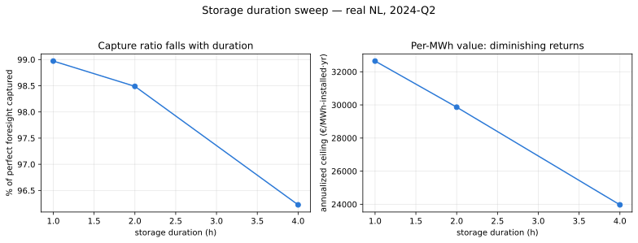

# Storage duration: how much does the energy-to-power ratio matter?

**Answer: enough that a single-duration headline can state a false general claim.**
On the same real Dutch quarter, the annualized net ceiling falls from about
**€33k per MWh-installed per year at 1 hour to about €24k at 4 hours**.

Governing decision: [ADR-0022](../decisions/0022-storage-duration-reported-axis.md).

## The question

The optimizer math is scale-invariant: the degradation cost is per MWh of
throughput, the state-of-charge balance is per-unit, and the model reduces
correctly at any energy-to-power ratio. That invariance makes it tempting to
report one representative asset and treat duration as an incidental config value.

The economics are not scale-invariant, and the qualitative conclusions flip across
the 1 h to 4 h range.

## Result

Revenue per MWh installed shows **diminishing returns in duration**. The first
hour of storage arbitrages peak against trough; the fourth arbitrages a much
flatter part of the daily curve, so each added hour captures a smaller slice of
the spread.



Two consequences run deeper than the headline number:

- **The capture ratio falls as duration rises.** Cross-day overnight carry value
  grows with duration, so a short asset's no-look-ahead policy is closer to
  optimal than a long one's. The near-99% capture the project reports is a
  property of a 1-hour asset.
- **The value of the uncertainty layer scales with duration.** There is little
  headroom at 1 hour and real headroom at 4. Reporting the stochastic value at a
  single duration would understate or overstate how generally it applies.

## Why this is a study and not a setting

A single-duration headline is not merely incomplete. It can state a general claim
("the uncertainty layer adds little", or "it captures real value") that is
actually a property of the duration chosen. The decision on record is therefore to
treat duration as a **first-class reported axis** across {1 h, 2 h, 4 h}, and to
name the duration whenever a figure is quoted for one asset.

The formulation is unchanged by this. It is a reporting requirement, not a model
change.

## Reproduce

```bash
uv run --group examples python examples/duration_sweep.py
```
